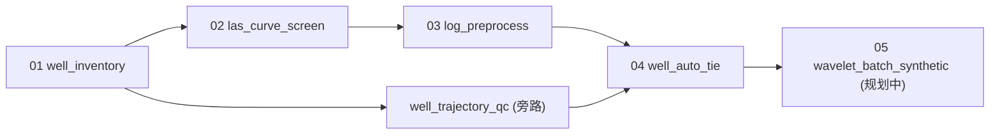

# 时间域工作流总览

时间域主链由五个顺序步骤 + 一个旁路脚本组成。

## 主链

| 步骤 | 脚本 | 输入 | 输出 |
|------|------|------|------|
| 01 | `well_inventory.py` | Petrel 井头、LAS 目录、地震体 | `well_inventory.csv` |
| 02 | `las_curve_screen.py` | `well_inventory.csv`、LAS 目录 | `well_curve_screen.csv`、`selected_las/` |
| 03 | `log_preprocess.py` | `well_curve_screen.csv`、`selected_las/` | `well_preprocess_status.csv`、`preprocessed_las/` |
| 04 | `well_auto_tie.py` | 03 产物 + 时深表 + 井分层 + 轨迹 QC | `well_tie_metrics.csv`、优化后 TDT、子波 |
| 05 | `global_wavelet_generation.py`（规划中） | 04 子波 + 预处理 LAS | 全局子波生成与批量合成记录 |

## 旁路

| 脚本 | 说明 | 运行时机 |
|------|------|----------|
| `well_trajectory_qc.py` | 解析轨迹文件，复核井型（直/斜），输出轨迹几何事实 | 01 之后，04 之前 |

旁路不改变主链编号，但 04 的路由决策依赖轨迹 QC 的输出。

## 数据流

## 第五步当前状态

时间域第五步目前还是规划文档，尚未落地为 `scripts/global_wavelet_generation.py`。设计见 `docs/guide/5-global-wavelet-generation.md`。
现有 `scripts/wavelet_batch_synthetic_depth.py` 是深度域 legacy 脚本，
只能作为思路参考，不能视为时间域主链第五步的实现。

## 深度域 Legacy 工作流

深度域脚本（`scripts/*_depth.py`）独立于上述主链，互不依赖。
两者共享 `src/cup/` 库函数与 `src/wtie/` 核心，但脚本层面的
输入/输出产物不交叉。
