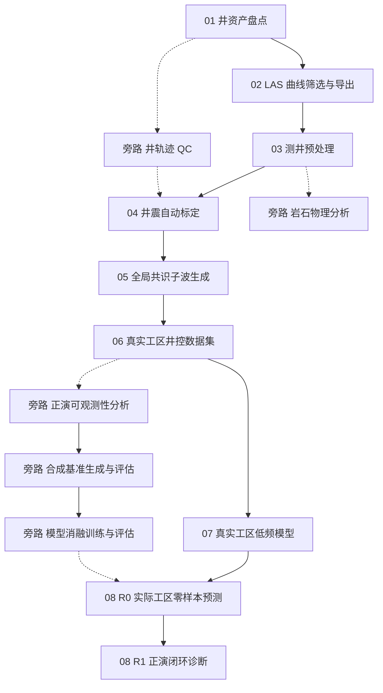

# 工作流总览

## 配置文件

| 步骤 | 配置文件 |
|------|---------|
| 01–07 | `experiments/common/common.yaml` |
| 07 · modifier 实验 | `experiments/real_field_lfm/real_field_lfm.yaml` |
| 旁路 · well_trajectory | `experiments/common/common.yaml` |
| 旁路 · rock_physics_analysis | `experiments/common/common.yaml` |
| 旁路 · forward_observability | `experiments/common/common.yaml` |
| 旁路 · synthoseis_lite | `experiments/synthoseis_lite/synthoseis_lite.yaml` |
| 旁路 · ablation | `experiments/ablation/train.yaml` |
| 08 R0-R1 | `experiments/common/common.yaml` |

## 深度域工作流

深度域是一次性处理路径，Step 1–3、6 与时间域共享。
Step 4/5 使用独立脚本，详见
[深度域工作流](guide/depth-domain-workflow.md)。
