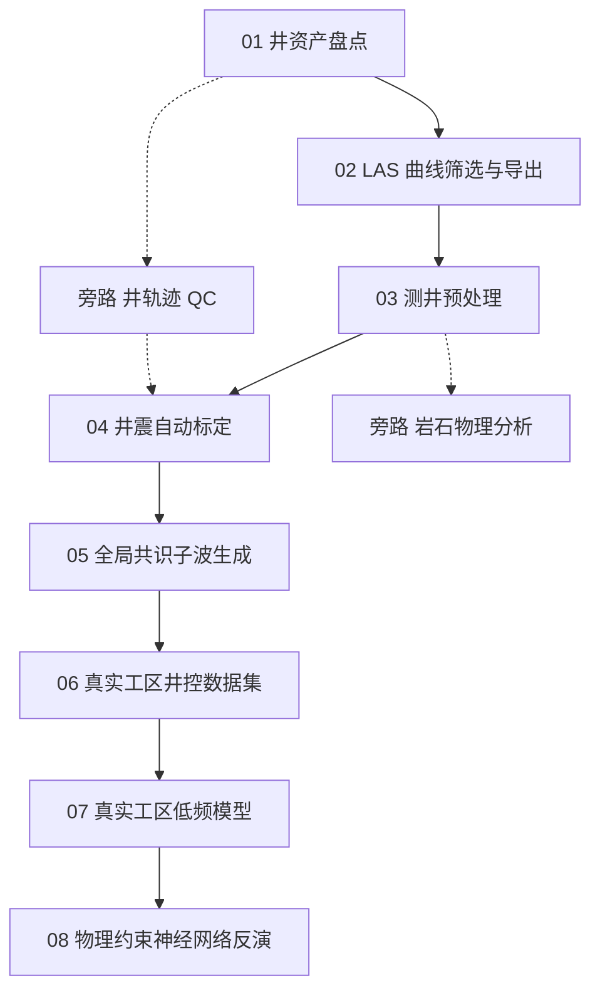

# 工作流总览

```mermaid
flowchart TB
    S1["01 井资产盘点"] --> S2["02 LAS 曲线筛选与导出"] --> S3["03 测井预处理"] --> S4["04 井震自动标定"] --> S5["05 全局共识子波生成"] --> S6["06 真实工区井控数据集"] --> S7["07 真实工区低频模型"] --> S8["08 物理约束神经网络反演"]

    WT["旁路 井轨迹 QC"]
    S1 -.-> WT -.-> S4

    RP["旁路 岩石物理分析"]
    S3 -.-> RP
```

## 配置文件

| 步骤 | 配置文件 |
|------|---------|
| 01–07 | `experiments/common/common.yaml` |
| 07 · modifier 实验 | `experiments/real_field_lfm/real_field_lfm.yaml` |
| 旁路 · well_trajectory | `experiments/common/common.yaml` |
| 旁路 · rock_physics_analysis | `experiments/common/common.yaml` |
| 旁路 · synthoseis_lite | `experiments/synthoseis_lite/synthoseis_lite.yaml` |
| 08 · 物理约束神经网络反演 | `<inversion-config-yaml>` |

## 深度域工作流

深度域复用前三步的井数据准备，以及第六至第八步的井控、低频模型与神经网络反演入口。
第四、第五步使用独立脚本，正演输入按深度域组装，详见
[深度域工作流](guide/depth-domain-workflow.md)。
