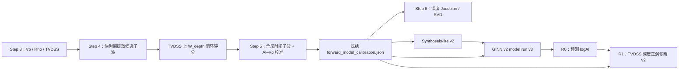

# 深度域正演能力重构设计

> 状态：已决策，可实施  
> 范围：叠后、零偏移、声学正演 v1  
> 当前工区：深度域地震，深度基准为 TVDSS，向下为正；井均为直井  
> 本文是实施规范。若实现与本文冲突，应先修改本文并记录原因，不得通过静默兼容或兜底绕过契约。

## 1. 目标

在 `src/cup/forward/` 建立同时支持时间域和深度域的统一正演能力，供井震标定、全局子波、可观测性分析、Synthoseis-lite、GINN v2 和 R1 共同使用。

重构后的核心性质如下：

- NumPy 与 PyTorch 后端提供同名、同语义 API。
- 时间域保留现有 Robinson 正演的数值语义。
- 深度域使用非平稳的纯深度域正演矩阵，不先把最终输出重采样到时间轴。
- 深度地震一律使用 TVDSS，单位为米，向下为正。
- 时间子波在时间域和深度域正演中都使用秒制时间轴。
- 核心内核只计算物理振幅，不填 NaN、不自动归一化、不施加 gain。
- 新实现不修改、不依赖 `src/ginn/`、`src/ginn_depth/` 中的遗留实现。
- 仓内调用迁移完成后删除重复正演函数，不保留静默兼容包装。

Step 1—3 已完成，主要负责数据盘点、曲线筛选和测井预处理，不引入正演。本重构从 Step 4 开始，但 Step 1—3 的产物必须继续提供明确单位和可解释的采样轴，供后续严格校验。

## 2. 非目标

本版本不处理：

- 叠前、角度道集、AVO/AVA 或各向异性；
- 斜井的 MD—TVDSS 轨迹变换；
- 上覆层绝对双程旅行时恢复；
- 深度域子波本身的定义或估计；
- 对遗留 `ginn`、`ginn_depth`、`wtie` 包进行迁移或清理；
- 读取旧 benchmark、checkpoint 或诊断产物并自动升级。

当前井均为直井，使用 `TVDSS = MD - KB`。未来支持斜井时，必须引入井轨迹并单独设计，不得沿用该等式。

## 3. 现状审计

### 3.1 重复的正演实现

| 位置 | 当前语义 | 当前调用方 | 重构要求 |
|---|---|---|---|
| `src/cup/seismic/observability.py` | NumPy；`tanh(ΔlogAI/2)`；`np.convolve(..., mode="same")`；输出 `N-1` | Step 6、Synthoseis-lite | 迁移至 NumPy 时间后端并固化数值 fixture |
| `src/ginn_v2/real_field.py` | 批量 NumPy；输出 `N-1`；会沿轴填充非有限值 | R1 等实际工区诊断 | 调用统一后端；删除核心前的静默填值逻辑 |
| `src/ginn_v2/training.py` | PyTorch `conv1d`；可微；输出 `N-1` | GINN v2 physics loss | 迁移至 PyTorch 后端并保持时间域逐点一致 |
| `src/wtie/modeling/modeling.py` | 裸卷积；偶数子波会自动补零 | Step 4/5 | `wtie` 保持不动；新核心禁止复制该兜底行为 |
| `src/ginn/physics.py` | 遗留 PyTorch 声学反射率 | 遗留 GINN | 仅作对照，不迁移 |
| `src/ginn_depth/physics.py` | 遗留深度域非平稳矩阵 | 遗留 GINN depth | 固化数值 fixture 后重新实现，不从新包导入遗留包 |

`wtie` 的声学反射率 `(AI₂-AI₁)/(AI₂+AI₁)` 与本设计的
`tanh((logAI₂-logAI₁)/2)` 数学等价。重构不改变反射率物理定义，只统一数组对齐、校验和后端行为。

### 3.2 工作流中的时间域假设

- Step 4 当前通过 TDT 把测井转换到 TWT，随后提取子波并用平稳卷积评分。
- Step 5 当前重复 TWT 转换和时间域卷积评价。
- Step 6 当前把正演视作平稳卷积，用 FFT 分析传递特性。
- Synthoseis-lite 当前契约和命名大量绑定 `twt_*`、`dt_s`。
- GINN v2 的 physics loss 只实现时间域平稳卷积。
- R1 当前通过时间域 `N-1` 正演函数构造合成地震，并使用时间域场景语义。

这些逻辑不能直接解释深度域地震。深度域中，相同时间子波在不同速度和深度位置对应不同的米制宽度，因此正演算子随位置变化。

### 3.3 坐标和几何问题

- `survey.py` 当前把 `depth` 域错误映射为 `md`，必须改为 `tvdss`。
- `wtie.processing.grid` 已支持 `twt`、`md`、`tvdss`、`tvdkb`；`Seismic` 可承载 TVDSS，但 `Reflectivity` 固定为 TWT 语义。深度域适配器可复用 `Log`/`Seismic`，深度界面反射率在内核中使用显式数组，不伪装成 `wtie` 的 TWT `Reflectivity`。
- 当前地震体 inline 步长为 1、xline 步长为 4。任何 `line_number - first_line` 直接作为数组下标的写法都不成立。体数据位置必须通过显式 iline/xline 轴和 `SurveyLineGeometry` 计算。

## 4. 物理与离散约定

### 4.1 轴、单位和形状

令：

- `log_ai[..., i] = ln(AI_i)`，最后一维长度为 `N`；
- `velocity_mps[..., i] = Vp_i`，单位 `m/s`，形状与 `log_ai` 相同；
- `depth_m[i] = z_i`，一维公共 TVDSS 轴，单位米，长度 `N`，严格递增；
- `wavelet_time_s[k]` 为规则采样的秒制子波时间轴，长度 `M`；
- `wavelet_amp[k]` 为子波振幅，长度 `M`。

批量维使用 `...` 表示。v1 中一批样本共享同一个一维深度轴和同一个时间子波。需要逐样本不同轴或不同子波时，应由调用方显式循环或在后续版本扩展 API，不做隐式广播猜测。

### 4.2 反射率

反射率挂在下部界面，即输出索引 `j` 表示样点 `j` 与 `j+1` 之间的界面：

```text
r[..., j] = tanh((log_ai[..., j+1] - log_ai[..., j]) / 2)
```

因此：

- 输入 `log_ai` 长度为 `N`；
- 输出反射率长度为 `N-1`；
- 不在头尾补零；
- 不把反射率伪装成与样点一一对应的 `N` 点数据。

### 4.3 时间域正演

时间域正演统一现有 Robinson 离散卷积语义：

```text
s_time = convolve(r, wavelet_amp, mode="same")
```

输出长度为 `N-1`。新 NumPy 实现必须与当前 `src/cup/seismic/observability.py` 的有限输入结果逐点一致；PyTorch 实现必须与 NumPy 结果在约定容差内一致，并保持可微。

时间域 API 不借长度推断输入域。调用方必须根据显式 `domain` 分派。

### 4.4 相对双程旅行时

深度正演只需要样点和界面的相对双程旅行时，不需要地震基准面到第一测井样点的绝对 TWT。

对每一深度区间，使用梯形慢度积分：

```text
Δz_i       = z_{i+1} - z_i
Δtwt_i     = 2 * Δz_i * 0.5 * (1 / v_i + 1 / v_{i+1})
t_sample_0 = 0
t_sample_i = Σ_{k=0}^{i-1} Δtwt_k
```

界面时间位于相邻样点累计 TWT 的中点：

```text
t_interface_j = 0.5 * (t_sample_j + t_sample_{j+1})
```

速度必须是有限正数。深度必须有限且严格递增。违反条件立即报错。

### 4.5 深度域非平稳正演

深度域算子定义为：

```text
W_depth[..., l, j] = w(t_sample[..., l] - t_interface[..., j])
d_depth[..., l]    = Σ_j W_depth[..., l, j] * r[..., j]
```

其中：

- `W_depth` 形状为 `[..., N, N-1]`；
- 输出 `d_depth` 形状为 `[..., N]`，与 TVDSS 深度样点严格对齐；
- `w(τ)` 由 `wavelet_time_s`、`wavelet_amp` 做一维线性插值得到；
- 超出子波时间支撑范围时振幅为 0；
- 不进行振幅阈值截断；
- 不自动归一化、不乘 gain、不做标准化。

默认按 64 个输出深度样点分块计算 `W_chunk @ r`，避免实体化完整矩阵。只有 `return_operator=True` 时才返回完整 `W_depth`。分块路径与完整矩阵路径必须数值一致。

### 4.6 时间子波契约

时间域和深度域使用相同的时间子波契约：

- `wavelet_time_s` 与 `wavelet_amp` 都是一维、有限且等长；
- 长度为奇数且至少为 3；
- 时间轴严格递增并规则采样；
- 中心样点的时间必须为 0；
- 不要求零相位；
- 不接受偶数长度后自动补零；
- 不在核心中自动重采样、归一化或移相。

“中心样点为零时刻”是坐标契约，不等于“中心振幅最大”或“子波零相位”。

### 4.7 AI—Vp 关系

工区级线性关系定义为：

```text
AI = a * Vp + b
Vp = (AI - b) / a
```

当前单位约定：

- `AI`：`m/s*g/cm3`；
- `Vp`：`m/s`；
- `a`：`g/cm3`；
- `b`：`m/s*g/cm3`。

必须满足 `a > 0`，并校验所有派生速度有限且大于 0。核心函数不猜测单位，不自动换算密度或阻抗单位。

实井正演优先使用实测 Vp 和 Rho 构造 AI，同时把实测 Vp 作为传播速度；AI—Vp 关系主要服务于仅预测 logAI 的合成数据与模型推理闭环。

## 5. 目标包和公共 API

### 5.1 包结构

```text
src/cup/forward/
├── __init__.py
├── numpy_backend.py
├── torch_backend.py
├── adapters.py
└── calibration.py
```

- `numpy_backend.py`：NumPy 时间/深度内核。
- `torch_backend.py`：同名 PyTorch 内核，支持 autograd。
- `adapters.py`：`wtie.processing.grid` 对象与裸内核之间的显式适配。
- `calibration.py`：AI—Vp 拟合、校准产物读写、哈希和严格校验。
- `__init__.py` 不得无条件导入 PyTorch，使基础 `cup` 使用场景保持 PyTorch 可选。

两个后端必须公开同名函数；参数名、轴约定、返回形状和错误条件一致。

### 5.2 `reflectivity_from_log_ai`

```python
reflectivity_from_log_ai(log_ai)
```

- 输入：`[..., N]`。
- 输出：`[..., N-1]`。
- 要求：浮点、有限，`N >= 2`。
- 语义：下部界面的 `tanh(ΔlogAI/2)`。

### 5.3 `forward_time`

```python
forward_time(
    log_ai,
    wavelet_time_s,
    wavelet_amp,
)
```

- 输出：`[..., N-1]`。
- 先执行公共子波校验，再计算反射率和 Robinson 卷积。
- `wavelet_time_s` 虽不参与卷积索引，也必须校验，以防无单位或中心不明确的子波进入工作流。

### 5.4 `build_depth_operator`

```python
build_depth_operator(
    velocity_mps,
    depth_m,
    wavelet_time_s,
    wavelet_amp,
    *,
    output_chunk_size=64,
)
```

- 返回完整 `W_depth[..., N, N-1]`。
- 该函数用于分析、fixture 和小规模调试，不是大批量正演默认路径。
- `output_chunk_size` 只控制构造过程的峰值临时内存，不改变最终完整矩阵返回。

### 5.5 `forward_depth`

```python
forward_depth(
    log_ai,
    velocity_mps,
    depth_m,
    wavelet_time_s,
    wavelet_amp,
    *,
    output_chunk_size=64,
    return_operator=False,
)
```

返回约定：

```python
# return_operator=False
seismic_depth

# return_operator=True
(seismic_depth, depth_operator)
```

- `seismic_depth` 为 `[..., N]`。
- `depth_operator` 为 `[..., N, N-1]`。
- 默认路径按输出深度块直接累加，不保留完整矩阵。
- `log_ai` 与 `velocity_mps` 形状必须完全一致，不做可能掩盖数据错配的广播。
- `depth_m` 必须是一维且长度为 `N`。

### 5.6 `ai_from_velocity` / `velocity_from_ai`

```python
ai_from_velocity(velocity_mps, *, a, b)
velocity_from_ai(ai, *, a, b)
```

- 显式实现 `AI=a·Vp+b` 及逆变换。
- 校验系数、输入和输出的有限性与正速度。
- `velocity_from_ai` 不截断负速度；不合法即报错。
- logAI 调用方必须先显式 `exp(log_ai)`，避免 API 猜测输入究竟是 AI 还是 logAI。

### 5.7 grid 适配器

适配器负责：

- 从 `grid.Log` 读取数值、采样轴、basis type 和单位；
- 对时间域要求 TWT basis，对深度域要求 TVDSS basis；
- 组装 `grid.Seismic` 并保留明确 basis；
- 在进入核心前完成调用方明确要求的重采样；
- 不长期裸传没有轴语义的数组。

深度界面反射率没有现成的 `wtie` 类型，不得标注成 TWT `grid.Reflectivity`。可在内核调用范围内保留数组，并同时携带明确的界面 TVDSS/TWT 坐标用于诊断。

## 6. 严格失败规则

以下情况必须立即抛出带字段名和期望契约的异常：

- `log_ai`、速度、深度或子波含 NaN/Inf；
- 速度不为正；
- 深度轴不严格递增；
- 时间子波不规则、长度为偶数、中心时间不为零或少于 3 点；
- logAI 与速度形状不完全一致；
- 配置中的 domain、basis 或轴字段互相矛盾；
- 校准哈希与模型/数据 manifest 不一致；
- 读取到不受支持的旧 schema；
- 时间域流程收到深度域字段，或深度域流程收到时间域专用字段。

禁止在统一核心或产物读取器中：

- 插值或前后填充 NaN；
- 猜测 CSV 字段语义；
- 猜测米、毫秒、秒或速度/阻抗单位；
- 自动归一化、增益补偿或振幅拟合；
- 自动把 MD 当 TVDSS；
- 自动把旧 schema 升级为新 schema；
- 因形状“刚好可广播”而接受错配输入。

数据清洗、振幅标定和标准化若确有需要，必须在上游以命名步骤显式执行，并记录到产物元数据。

## 7. 坐标、配置与几何迁移

### 7.1 TVDSS 修正

修正 `survey.py`：

```text
domain=time  -> basis_type=twt
domain=depth -> basis_type=tvdss
```

不得再把 depth 映射到 MD。当前直井从测井 MD 构造 TVDSS 时，显式使用井头 KB：

```text
TVDSS = MD - KB
```

输出列和对象 basis 必须命名为 TVDSS，不得继续保留名为 `depth`、实际含义不明的轴。

### 7.2 `WorkflowConfig`

将 `TimeWorkflowConfig` 重命名为 `WorkflowConfig`，迁移全部仓内调用后删除旧名字，不设置兼容别名。

地震配置要求：

```yaml
seismic:
  domain: depth
  depth_basis: tvdss
```

规则：

- `seismic.domain` 必填，只允许 `time` 或 `depth`。
- domain 为 `depth` 时，`depth_basis` 必填且 v1 只允许 `tvdss`。
- domain 为 `time` 时，禁止出现 `depth_basis`。
- 米制边界使用显式 `_m` 后缀，如 `margin_top_m`、`margin_bottom_m`、`depth_shift_min_m`。
- 秒制边界使用 `_s`，不接受无单位的通用字段。
- 错域字段直接报错，不忽略。

### 7.3 体数据几何

所有体数据抽取和位置计算必须：

1. 读取显式 iline、xline 坐标轴；
2. 使用 `SurveyLineGeometry` 从线号解析数组位置；
3. 校验请求线号确实位于轴上；
4. 不假设步长为 1，不把线号差直接当下标。

回归测试固定覆盖 inline 步长 1、xline 步长 4。

`zgy_inline_chunk_size` 只影响 ZGY 读取/分块策略；SEG-Y 输入不得让该字段参与物理坐标或正演语义。配置校验应在 SEG-Y 场景拒绝或明确忽略该存储专用字段，具体采取哪一种须与现有配置严格策略保持一致，但不得影响结果。

## 8. 工作流迁移



### 8.1 Step 4：井震自动标定

深度域流程：

1. 将预处理后的 Vp、Rho 和地震道对齐到原始 TVDSS 轴。
2. 使用实测 `AI = Vp * Rho` 构造 logAI，传播速度使用实测 Vp。
3. 由实测 Vp 的梯形慢度积分生成相对 TWT。
4. 临时把连续 Vp、Rho 和深度地震投影到规则相对 TWT，仅用于复用 `wtie` 的候选时间子波提取能力。
5. 候选子波回到原始 TVDSS 轴，通过统一 `forward_depth` 生成 `N` 点深度合成地震。
6. 所有最终评分、QC 图和成功判定以 TVDSS 上的深度闭环为准。

深度域 Step 4：

- 不生成 TDT；
- 不优化 TDT；
- 不允许 stretch/squeeze；
- 只允许扫描常量 `depth_shift_m ∈ [-30, 30]`；
- 深度平移与子波相位是两个独立参数，不互相替代；
- 不修改 `src/wtie/`。

Step 4 产物必须记录 `sample_domain=depth`、`depth_basis=tvdss`、`depth_shift_m`、参与评分的 TVDSS 范围、Vp/Rho 来源和候选时间子波来源。深度域产物不得出现伪造或空白占位的 TDT 字段。

时间域 Step 4 保留现有 TDT/TWT 流程，但改为调用统一 NumPy 时间后端进行最终闭环，确保时间域没有发生数值漂移。

### 8.2 Step 5：全局子波与正演校准

候选和最终全局子波仍是时间域子波，时间轴单位为秒。

深度域选择规则：

- 每个候选子波必须在所有成功井上使用 `forward_depth` 评价；
- 先计算每口井的指标，再做等井权重汇总，避免长井或高采样井支配结果；
- 最终冻结一条全工区时间子波；
- 使用成功井的实测 AI、Vp，按等井权重 Huber 回归拟合全工区一组 `AI=a·Vp+b`；
- 拟合不改变实井 Step 4/5 正演优先使用实测 Vp/Rho 的原则。

等井权重的实现必须先使每口井的样点权重和相同，再进入 Huber 优化；不得简单拼接所有样点后拟合。

Step 5 输出冻结的 `forward_model_calibration.json`，后续步骤只读。任何会改变 a/b、子波或源井集合的操作都必须重新生成该文件及哈希。

### 8.3 Step 6：正演可观测性分析

按 domain 分派：

- 时间域：保留原 FFT 传递分析，并改用统一时间后端。
- 深度域：分析耦合映射 `logAI → AI → Vp → W_depth → seismic_depth` 的局部 Jacobian。

深度域至少同时报告：

1. **固定速度敏感度**：扰动 logAI，保持实测 Vp 不变，只反映反射率项；
2. **AI—速度耦合敏感度**：由冻结 a/b 将扰动后的 AI 转为 Vp，同时改变反射率与 `W_depth`。

实现使用 PyTorch autograd 构造局部 Jacobian，并对其做 SVD 或等价的局部谱分析。随机抽取若干列，用中心有限差分复核 autograd 结果。

深度轴探针使用 `cycles/km` 的深度波数；Hz 仅用于描述时间子波的频谱，不得把 Hz 直接解释为深度数据的轴向分辨率。报告应明确分析井、TVDSS 窗口、线性化点、固定/耦合模式、校准哈希和奇异值截断规则。

### 8.4 Synthoseis-lite

现有管线升级为显式 time/depth 双域，不另建一套互相漂移的脚本。

深度场景生成顺序：

1. 生成目标 `logAI`；
2. `AI = exp(logAI)`；
3. 使用冻结 a/b 派生 `vp_mps`；
4. 通过 `forward_depth` 生成 TVDSS 上 `N` 点深度地震；
5. 保存 logAI 主真值和 Vp 辅助真值。

高分辨率场景必须先在高分辨率 TVDSS 轴上做 `W_depth` 正演，再经过有记录的抗混叠和降采样得到目标 5 m 网格，并执行闭合 QC。不得先把 logAI 降采样再声称是同一个高分辨率正演结果。

扰动语义：

- 相位/时间移位作用于秒制时间子波，然后再构造深度算子；
- 轴向静差使用米；
- 禁止把“移动若干深度样点”解释为时间移位；
- 振幅缩放和噪声是显式场景参数，不进入统一正演核心。

### 8.5 GINN v2

- NumPy 诊断和 PyTorch physics loss 分别调用统一 NumPy/PyTorch 后端。
- 主监督目标保持 logAI。
- 深度域 physics loss 使用预测 logAI 和冻结 a/b 派生 Vp，再调用 `forward_depth`。
- 时间域 physics loss 调用 `forward_time`。
- 模型运行 manifest 必须记录 `sample_domain`、轴 basis、正演校准哈希和 synthoseis schema。
- 训练时发现数据集、配置、checkpoint 三者 domain 或校准哈希不一致，立即停止。

迁移完成后删除 `src/ginn_v2/real_field.py` 中重复的 `forward_log_ai` 和 `src/ginn_v2/training.py` 中的 `_torch_forward_log_ai`，不得保留转发包装。

### 8.6 R1：实际工区正演闭环

深度域 R1：

1. 读取 R0 预测的 logAI、明确的 TVDSS 轴和冻结校准哈希；
2. 使用完全相同的冻结 a/b 派生 Vp；
3. 使用冻结的秒制时间子波和 `forward_depth` 生成 `N` 点合成深度地震；
4. 严格校验合成与观测的 TVDSS 轴逐点一致；
5. 在同一 TVDSS 窗口计算闭环指标。

相位场景先扰动时间子波再正演；深度平移以米为单位单独扫描。二者必须分别出现在场景参数和结果列中。

### 8.7 Step 7 与 R0

Step 7/R0 不执行正演，但其输入、模型调用和输出必须携带：

- `sample_domain`；
- `depth_basis=tvdss`；
- 明确命名的 TVDSS 轴或其引用；
- `forward_model_calibration_sha256`。

缺少任一项时，R1 不得继续。

## 9. 产物与 schema 契约

### 9.1 `forward_model_calibration.json`

建议最小结构：

```json
{
  "schema": "forward_model_calibration_v1",
  "sample_domain": "depth",
  "depth_basis": "tvdss",
  "ai_velocity_relation": {
    "formula": "AI = a * Vp + b",
    "a": 0.0,
    "b": 0.0,
    "ai_unit": "m/s*g/cm3",
    "vp_unit": "m/s",
    "a_unit": "g/cm3",
    "b_unit": "m/s*g/cm3",
    "fit_method": "equal_well_weight_huber",
    "huber_delta": 0.0
  },
  "fit_qc": {
    "well_ids": [],
    "well_count": 0,
    "sample_count_by_well": {},
    "metrics_by_well": {},
    "aggregate_metrics": {}
  },
  "wavelet": {
    "path": "",
    "sha256": "",
    "time_unit": "s",
    "sample_count": 0,
    "dt_s": 0.0
  },
  "sources": [
    {"path": "", "sha256": ""}
  ]
}
```

实际写出前，所有占位值必须被真实值替换。文件自身 SHA-256 作为 `forward_model_calibration_sha256` 写入下游产物。哈希计算必须基于冻结文件的原始字节，不基于重新序列化后的对象。

### 9.2 `synthoseis_lite_v2`

共同字段：

- `schema=synthoseis_lite_v2`；
- `sample_domain=time|depth`；
- `forward_model_calibration_sha256`；
- 子波引用及哈希；
- 所有数组 shape、dtype、单位和轴引用。

轴字段：

- 时间轴只使用 `twt_start_s`、`twt_step_s`、`twt_values_s` 等 `twt_*_s` 名称；
- 深度轴只使用 `tvdss_start_m`、`tvdss_step_m`、`tvdss_values_m` 等 `tvdss_*_m` 名称；
- 禁止无单位的通用 `sample_axis`、`sample_step`、`z`。

深度样本必须包含：

- `target_log_ai`：`N` 点；
- `vp_mps`：`N` 点辅助真值；
- `seismic_depth`：`N` 点；
- TVDSS 轴：`N` 点。

时间域正演继续输出 `N-1` 点。数据集 reader 必须依据 `sample_domain` 和字段契约读取，不能用长度猜域。

### 9.3 模型 manifest

模型运行 schema 升级为：

```text
ginn_v2_model_run_v3
```

至少记录：

- `sample_domain` 和 basis；
- 输入/目标轴契约；
- `synthoseis_lite_v2` 数据集标识与哈希；
- `forward_model_calibration_sha256`；
- NumPy/PyTorch 正演实现版本或代码提交标识；
- physics loss 模式：`time`、`depth_fixed_velocity` 或 `depth_coupled_velocity`。

### 9.4 R1 摘要

R1 摘要升级为 v2，至少包含：

- schema 与 `sample_domain`；
- TVDSS/TWT 轴名称、单位、范围和样点数；
- 观测、预测 logAI、派生 Vp、合成地震的来源哈希；
- 正演校准哈希；
- 子波相位场景与深度平移场景的独立参数；
- 轴严格一致校验结果；
- 闭环指标和有效窗口。

## 10. 兼容策略

新代码继续支持时间域计算，但不兼容旧的 benchmark、checkpoint 和诊断产物。

读取到以下旧产物时必须报出 schema、实际版本、期望版本和重建命令/指南入口：

- `synthoseis_lite_v1` 或无 schema 的合成数据；
- `ginn_v2_model_run_v2` 及更早模型；
- R1 v1 或无 domain/校准哈希的摘要；
- 无明确 TWT/TVDSS 单位轴的中间产物。

禁止：

- 根据字段存在性静默推断版本；
- 为旧 checkpoint 注入默认 domain；
- 为旧深度数据补一个虚构的校准哈希；
- 保留旧 `forward_log_ai` 名称作为兼容包装。

`src/wtie/`、`src/ginn/`、`src/ginn_depth/` 保持原样，仅用于对照和 fixture 生成，不作为新运行路径的依赖。

## 11. 实施顺序与提交门禁

### 阶段 1：数值基线

1. 为当前时间域 NumPy Robinson 正演固化有限、奇数子波的数值 fixture。
2. 为 `src/ginn_depth/physics.py` 的旧深度矩阵固化小规模数值 fixture。
3. fixture 写明输入单位、轴、shape 和旧实现提交标识。

门禁：fixture 可独立加载，且没有通过导入遗留实现实时生成期望值。

### 阶段 2：统一内核

1. 实现 NumPy/PyTorch 时间内核。
2. 实现相对 TWT、线性子波插值和完整深度算子。
3. 实现默认 64 点输出分块路径。
4. 实现 grid 适配器和 AI—Vp 变换。

门禁：时间 fixture、旧深度 fixture、后端一致性和 gradcheck 全部通过。

### 阶段 3：坐标和 Step 4/5

1. 修正 `survey.py` 的 TVDSS 语义。
2. `TimeWorkflowConfig` 全量迁移为 `WorkflowConfig`。
3. 增加 domain/depth_basis 严格配置。
4. 迁移 Step 4 的伪时间提取和 TVDSS 评分。
5. 迁移 Step 5，并生成冻结正演校准。

门禁：单井 Step 4 深度闭环和多井 Step 5 校准产物通过 schema、单位、哈希校验。

### 阶段 4：可观测性

1. 时间域 Step 6 改用统一后端。
2. 实现深度固定速度和耦合速度 Jacobian/SVD。
3. 增加 cycles/km 探针和有限差分抽查。

门禁：报告不再用 Hz 代替深度波数，Jacobian 抽查在容差内。

### 阶段 5：合成数据与训练

1. 升级 Synthoseis-lite 写出器和 reader 到 v2。
2. 实现 time/depth 小型端到端数据集。
3. 迁移 GINN v2 physics loss 和运行 manifest 到 v3。

门禁：time/depth 两套合成闭合，训练拒绝错域或错哈希输入。

### 阶段 6：实际工区闭环和清理

1. 迁移 Step 7/R0 的 domain、轴和哈希携带契约。
2. 迁移 R1 到 v2 深度闭环。
3. 迁移 `real_delta` 等剩余稳定调用方。
4. 全仓搜索并删除重复 `forward_log_ai`、`_torch_forward_log_ai`。

门禁：除 fixture/文档中的历史说明外，新路径不再导入遗留正演；旧 schema 明确失败；仓内所有生产调用只经过 `cup.forward`。

## 12. 测试规范

测试由实现方编写，用户在本地环境运行。至少覆盖：

1. 新时间 NumPy 实现与当前 Robinson 正演逐点一致。
2. NumPy/PyTorch 时间结果一致。
3. NumPy/PyTorch 深度结果一致。
4. 分块深度结果与完整旧 `W_depth` fixture 一致。
5. `return_operator=False` 不实体化完整矩阵；`True` 返回正确 shape。
6. PyTorch 对 logAI 和速度分别通过双精度 `gradcheck`。
7. 常速度模型满足解析相对 TWT、界面时间和矩阵权重预期。
8. 子波线性插值在节点、节点中点和支撑区外行为正确。
9. 非有限值、非正速度、非递增深度、偶数子波、非规则子波均明确失败。
10. AI—Vp 正反变换、单位元数据、`a > 0` 和派生正速度校验。
11. AI—Vp 等井权重 Huber 拟合不受单井样点数复制影响。
12. Step 4 伪时间提取后回到原始 TVDSS 的闭环。
13. Step 4 深度域拒绝 TDT 优化和 stretch/squeeze。
14. Step 6 Jacobian 与中心有限差分抽查一致。
15. time/depth 两套 Synthoseis-lite 小型端到端闭合。
16. 深度高分辨率正演、抗混叠、5 m 降采样路径闭合。
17. 数据集、模型、R1 对旧 schema 和错校准哈希明确失败。
18. R1 深度合成、观测与 TVDSS 轴逐点严格一致，三者均为 `N` 点。
19. 相位扰动只改变时间子波，深度平移只使用米制参数。
20. inline 步长 1、xline 步长 4 的体采样集成测试。

测试容差必须按 dtype 和运算路径显式设置。不能通过放宽全局容差掩盖 NumPy/PyTorch 的核翻转、界面对齐或半样点偏移错误。

## 13. 验收标准

本重构完成需同时满足：

- `src/cup/forward/` 是新工作流唯一的正演实现来源；
- 时间域 fixture 证明重构没有改变既有 Robinson 数值结果；
- 深度域输出为原始 TVDSS 轴上的 `N` 点，且分块/完整、NumPy/PyTorch 一致；
- Step 4 在深度域不生成或优化 TDT，最终评分来自 TVDSS 深度闭环；
- Step 5 冻结全局时间子波和一组等井权重 Huber AI—Vp 校准；
- Step 6 同时报告固定速度和耦合速度敏感度，并使用 cycles/km；
- Synthoseis-lite v2、GINN v2 model run v3、R1 v2 的 domain、轴、单位和哈希可追溯；
- Step 7/R0 虽不正演，仍完整传递 domain、TVDSS 轴和校准哈希；
- xline 步长 4 不造成位置偏移或错误索引；
- 所有旧 schema 均以可操作的错误要求重建，不被静默读取；
- 核心没有 NaN 填充、自动归一化、gain 或单位猜测；
- 遗留 `wtie`、`ginn`、`ginn_depth` 未被修改或变成新实现依赖。

## 14. 主要风险与控制

| 风险 | 表现 | 控制 |
|---|---|---|
| 界面半样点错位 | 合成事件系统性偏移 | 明确下部界面和界面 TWT 中点；解析测试 |
| PyTorch 卷积核方向错误 | 时间后端与 NumPy 相位相反 | 固化非对称子波 fixture |
| 深度矩阵内存过大 | 批量训练 OOM | 默认 64 输出点分块，仅显式请求完整算子 |
| AI—Vp 拟合被长井支配 | 派生速度偏向单井 | 等井权重 Huber，逐井和汇总 QC |
| 伪时间步骤被误当最终结果 | Step 4 指标仍是时间域 | 伪时间只提取候选，最终成功判定必须来自 TVDSS 闭环 |
| 时间相位与深度静差混淆 | 场景不可解释 | 秒制子波扰动和米制平移使用独立字段及扫描 |
| 旧产物混入新模型 | domain 或标定不可追溯 | schema 和 SHA-256 严格校验，不提供自动升级 |
| 线号当数组下标 | xline 步长 4 时取错道 | 显式轴 + `SurveyLineGeometry` + 集成测试 |

该设计的核心边界是：时间子波仍属于时间坐标，地震输出属于声明的采样域；速度场通过相对旅行时把两者连接起来。任何试图用“样点数相同”替代坐标、单位和 domain 契约的实现，都不符合本规范。
