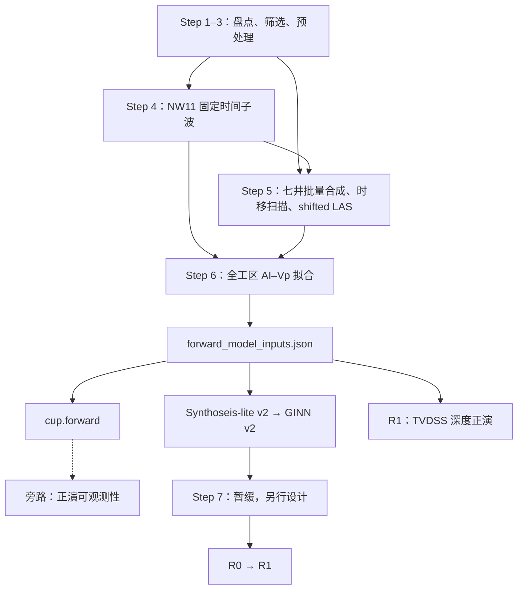

# 深度域正演能力重构设计

> 状态：已决策，可实施  
> 范围：叠后、零偏移、声学正演 v1  
> 当前工区：深度域地震，深度基准为 TVDSS，向下为正；井均为直井  
> 本文是实施规范。若实现与本文冲突，应先修改本文并记录原因，不得通过静默兼容或兜底绕过契约。

## 1. 目标

在 `src/cup/forward/` 建立同时支持时间域和深度域的统一正演能力，供 Synthoseis-lite、GINN v2 和 R1 共同使用。正演可观测性分析是非阻塞旁路，不是统一正演内核及其下游的前置门禁；时间域工区持续运行既有 FFT/有限差分旁路，延期的只是深度域扩展。

重构后的核心性质如下：

- NumPy 与 PyTorch 后端提供同名、同语义 API。
- 时间域保留现有 Robinson 正演的数值语义。
- 深度域使用非平稳的纯深度域正演矩阵，不先把最终输出重采样到时间轴。
- 深度地震一律使用 TVDSS，单位为米，向下为正。
- 时间子波在时间域和深度域正演中都使用秒制时间轴。
- 核心内核只计算物理振幅，不填 NaN、不自动归一化、不施加 gain。
- 新实现不修改、不依赖 `src/ginn/`、`src/ginn_depth/` 中的遗留实现。
- 仓内调用迁移完成后删除重复正演函数，不保留静默兼容包装。

Step 1—3 已完成，主要负责数据盘点、曲线筛选和测井预处理，不引入正演。当前深度工区正式采用工区专用的旧 Step 4/5：Step 4 从 NW11 提取固定时间子波；Step 5 用该子波完成七口井的批量合成、时移扫描和 shifted LAS 输出。两个脚本保留在 `scripts/`，但不迁入公共 API。新 Step 6 在这些冻结产物上拟合全工区唯一的 AI—Vp 关系，并生成后续统一使用的 `forward_model_inputs.json`。

## 2. 非目标

本版本不处理：

- 叠前、角度道集、AVO/AVA 或各向异性；
- 斜井的 MD—TVDSS 轨迹变换；
- 上覆层绝对双程旅行时恢复；
- 深度域子波本身的定义或估计；
- 对遗留 `ginn`、`ginn_depth`、`wtie` 包进行迁移或清理；
- 读取旧 benchmark、checkpoint 或诊断产物并自动升级。

当前井均为直井，使用 `TVDSS = MD - KB`。未来支持斜井时，必须引入井轨迹并单独设计，不得沿用该等式。

## 3. 现状审计

### 3.1 重复的正演实现

| 位置 | 当前语义 | 当前调用方 | 重构要求 |
|---|---|---|---|
| `src/cup/seismic/observability.py` | NumPy；`tanh(ΔlogAI/2)`；`np.convolve(..., mode="same")`；输出 `N-1` | 延期的可观测性旁路、现有 Synthoseis-lite | 固化时间域数值 fixture；Synthoseis 调用迁至统一后端，可观测性旁路本轮不作为门禁 |
| `src/ginn_v2/real_field.py` | 批量 NumPy；输出 `N-1`；会沿轴填充非有限值 | R1 等实际工区诊断 | 调用统一后端；删除核心前的静默填值逻辑 |
| `src/ginn_v2/training.py` | PyTorch `conv1d`；可微；输出 `N-1` | GINN v2 physics loss | 迁移至 PyTorch 后端并保持时间域逐点一致 |
| `src/wtie/modeling/modeling.py` | 裸卷积；偶数子波会自动补零 | 工区专用 Step 4/5 | `wtie` 保持不动；新核心禁止复制该兜底行为 |
| `src/ginn/physics.py` | 遗留 PyTorch 声学反射率 | 遗留 GINN | 仅作对照，不迁移 |
| `src/ginn_depth/physics.py` | 遗留深度域非平稳矩阵 | 遗留 GINN depth | 固化数值 fixture 后重新实现，不从新包导入遗留包 |

`wtie` 的声学反射率 `(AI₂-AI₁)/(AI₂+AI₁)` 与本设计的
`tanh((logAI₂-logAI₁)/2)` 数学等价。重构不改变反射率物理定义，只统一数组对齐、校验和后端行为。

### 3.2 工作流中的时间域假设

- 当前工区的旧 Step 4/5 已在深度域实践中验证，其 NW11 子波、七井时移和 shifted LAS 是本轮正式上游产物，但脚本仍是工区专用实现。
- 原 Step 6 把正演视作平稳卷积，用 FFT 分析传递特性，并曾被设计为 Synthoseis 的强制门禁；这会把诊断旁路错误地变成生产依赖。
- Synthoseis-lite 当前契约和命名大量绑定 `twt_*`、`dt_s`。
- GINN v2 的 physics loss 只实现时间域平稳卷积。
- R1 当前通过时间域 `N-1` 正演函数构造合成地震，并使用时间域场景语义。

这些逻辑不能直接解释深度域地震。深度域中，相同时间子波在不同速度和深度位置对应不同的米制宽度，因此正演算子随位置变化。

### 3.3 坐标和几何问题

- `survey.py` 当前把 `depth` 域错误映射为 `md`，必须改为 `tvdss`。
- `wtie.processing.grid` 已支持 `twt`、`md`、`tvdss`、`tvdkb`；`Seismic` 可承载 TVDSS，但 `Reflectivity` 固定为 TWT 语义。深度域适配器可复用 `Log`/`Seismic`，深度界面反射率在内核中使用显式数组，不伪装成 `wtie` 的 TWT `Reflectivity`。
- 当前地震体 inline 步长为 1、xline 步长为 4。任何 `line_number - first_line` 直接作为数组下标的写法都不成立。体数据位置必须通过显式 iline/xline 轴和 `SurveyLineGeometry` 计算。

## 4. 物理与离散约定

### 4.1 轴、单位和形状

令：

- `log_ai[..., i] = ln(AI_i)`，最后一维长度为 `N`；
- `velocity_mps[..., i] = Vp_i`，单位 `m/s`，形状与 `log_ai` 相同；
- `depth_m[i] = z_i`，一维公共 TVDSS 轴，单位米，长度 `N`，严格递增；
- `wavelet_time_s[k]` 为规则采样的秒制子波时间轴，长度 `M`；
- `wavelet_amp[k]` 为子波振幅，长度 `M`。

批量维使用 `...` 表示。v1 中一批样本共享同一个一维深度轴和同一个时间子波。需要逐样本不同轴或不同子波时，应由调用方显式循环或在后续版本扩展 API，不做隐式广播猜测。

### 4.2 反射率

反射率挂在下部界面，即输出索引 `j` 表示样点 `j` 与 `j+1` 之间的界面：

```text
r[..., j] = tanh((log_ai[..., j+1] - log_ai[..., j]) / 2)
```

因此：

- 输入 `log_ai` 长度为 `N`；
- 输出反射率长度为 `N-1`；
- 不在头尾补零；
- 不把反射率伪装成与样点一一对应的 `N` 点数据。

### 4.3 时间域正演

时间域正演统一现有 Robinson 离散卷积语义：

```text
s_time = convolve(r, wavelet_amp, mode="same")
```

输出长度为 `N-1`。新 NumPy 实现必须与当前 `src/cup/seismic/observability.py` 的有限输入结果逐点一致；PyTorch 实现必须与 NumPy 结果在约定容差内一致，并保持可微。

时间域 API 不借长度推断输入域。调用方必须根据显式 `domain` 分派。

### 4.4 相对双程旅行时

深度正演只需要样点和界面的相对双程旅行时，不需要地震基准面到第一测井样点的绝对 TWT。

对每一深度区间，使用梯形慢度积分：

```text
Δz_i       = z_{i+1} - z_i
Δtwt_i     = 2 * Δz_i * 0.5 * (1 / v_i + 1 / v_{i+1})
t_sample_0 = 0
t_sample_i = Σ_{k=0}^{i-1} Δtwt_k
```

界面时间位于相邻样点累计 TWT 的中点：

```text
t_interface_j = 0.5 * (t_sample_j + t_sample_{j+1})
```

速度必须是有限正数。深度必须有限且严格递增。违反条件立即报错。

### 4.5 深度域非平稳正演

深度域算子定义为：

```text
W_depth[..., l, j] = w(t_sample[..., l] - t_interface[..., j])
d_depth[..., l]    = Σ_j W_depth[..., l, j] * r[..., j]
```

其中：

- `W_depth` 形状为 `[..., N, N-1]`；
- 输出 `d_depth` 形状为 `[..., N]`，与 TVDSS 深度样点严格对齐；
- `w(τ)` 由 `wavelet_time_s`、`wavelet_amp` 做一维线性插值得到；
- 超出子波时间支撑范围时振幅为 0；
- 不进行振幅阈值截断；
- 不自动归一化、不乘 gain、不做标准化。

默认按 64 个输出深度样点分块计算 `W_chunk @ r`，避免实体化完整矩阵。只有 `return_operator=True` 时才返回完整 `W_depth`。分块路径与完整矩阵路径必须数值一致。

### 4.6 时间子波契约

时间域和深度域使用相同的时间子波契约：

- `wavelet_time_s` 与 `wavelet_amp` 都是一维、有限且等长；
- 长度为奇数且至少为 3；
- 时间轴严格递增并规则采样；
- 中心样点的时间必须为 0；
- 不要求零相位；
- 不接受偶数长度后自动补零；
- 不在核心中自动重采样、归一化或移相。

“中心样点为零时刻”是坐标契约，不等于“中心振幅最大”或“子波零相位”。

### 4.7 AI—Vp 关系

工区级线性关系定义为：

```text
AI = a * Vp + b
Vp = (AI - b) / a
```

当前单位约定：

- `AI`：`m/s*g/cm3`；
- `Vp`：`m/s`；
- `a`：`g/cm3`；
- `b`：`m/s*g/cm3`。

必须满足 `a > 0`，并校验所有派生速度有限且大于 0。核心函数不猜测单位，不自动换算密度或阻抗单位。

该关系由新 Step 6 在原生 MD/TVDSS 测井样点上拟合，数学上不依赖地震采样域，也不得为了拟合投影到 TWT。实井正演优先使用实测 Vp 和 Rho 构造 AI，同时把实测 Vp 作为传播速度；冻结的全工区 AI—Vp 关系主要服务于仅预测 logAI 的合成数据与模型推理闭环。

## 5. 目标包和公共 API

### 5.1 包结构

```text
src/cup/forward/
├── __init__.py
├── numpy_backend.py
├── torch_backend.py
├── adapters.py
└── calibration.py
```

- `numpy_backend.py`：NumPy 时间/深度内核。
- `torch_backend.py`：同名 PyTorch 内核，支持 autograd。
- `adapters.py`：`wtie.processing.grid` 对象与裸内核之间的显式适配。
- `calibration.py`：AI—Vp 拟合、校准产物读写、哈希和严格校验。
- `__init__.py` 不得无条件导入 PyTorch，使基础 `cup` 使用场景保持 PyTorch 可选。

两个后端必须公开同名函数；参数名、轴约定、返回形状和错误条件一致。

### 5.2 `reflectivity_from_log_ai`

```python
reflectivity_from_log_ai(log_ai)
```

- 输入：`[..., N]`。
- 输出：`[..., N-1]`。
- 要求：浮点、有限，`N >= 2`。
- 语义：下部界面的 `tanh(ΔlogAI/2)`。

### 5.3 `forward_time`

```python
forward_time(
    log_ai,
    wavelet_time_s,
    wavelet_amp,
)
```

- 输出：`[..., N-1]`。
- 先执行公共子波校验，再计算反射率和 Robinson 卷积。
- `wavelet_time_s` 虽不参与卷积索引，也必须校验，以防无单位或中心不明确的子波进入工作流。

### 5.4 `build_depth_operator`

```python
build_depth_operator(
    velocity_mps,
    depth_m,
    wavelet_time_s,
    wavelet_amp,
    *,
    output_chunk_size=64,
)
```

- 返回完整 `W_depth[..., N, N-1]`。
- 该函数用于分析、fixture 和小规模调试，不是大批量正演默认路径。
- `output_chunk_size` 只控制构造过程的峰值临时内存，不改变最终完整矩阵返回。

### 5.5 `forward_depth`

```python
forward_depth(
    log_ai,
    velocity_mps,
    depth_m,
    wavelet_time_s,
    wavelet_amp,
    *,
    output_chunk_size=64,
    return_operator=False,
)
```

返回约定：

```python
# return_operator=False
seismic_depth

# return_operator=True
(seismic_depth, depth_operator)
```

- `seismic_depth` 为 `[..., N]`。
- `depth_operator` 为 `[..., N, N-1]`。
- 默认路径按输出深度块直接累加，不保留完整矩阵。
- `log_ai` 与 `velocity_mps` 形状必须完全一致，不做可能掩盖数据错配的广播。
- `depth_m` 必须是一维且长度为 `N`。

### 5.6 `ai_from_velocity` / `velocity_from_ai`

```python
ai_from_velocity(velocity_mps, *, a, b)
velocity_from_ai(ai, *, a, b)
```

- 显式实现 `AI=a·Vp+b` 及逆变换。
- 校验系数、输入和输出的有限性与正速度。
- `velocity_from_ai` 不截断负速度；不合法即报错。
- logAI 调用方必须先显式 `exp(log_ai)`，避免 API 猜测输入究竟是 AI 还是 logAI。

### 5.7 grid 适配器

适配器负责：

- 从 `grid.Log` 读取数值、采样轴、basis type 和单位；
- 对时间域要求 TWT basis，对深度域要求 TVDSS basis；
- 组装 `grid.Seismic` 并保留明确 basis；
- 在进入核心前完成调用方明确要求的重采样；
- 不长期裸传没有轴语义的数组。

深度界面反射率没有现成的 `wtie` 类型，不得标注成 TWT `grid.Reflectivity`。可在内核调用范围内保留数组，并同时携带明确的界面 TVDSS/TWT 坐标用于诊断。

## 6. 严格失败规则

以下情况必须立即抛出带字段名和期望契约的异常：

- `log_ai`、速度、深度或子波含 NaN/Inf；
- 速度不为正；
- 深度轴不严格递增；
- 时间子波不规则、长度为偶数、中心时间不为零或少于 3 点；
- logAI 与速度形状不完全一致；
- 配置中的 domain、basis 或轴字段互相矛盾；
- 正演输入哈希与模型/数据 manifest 不一致；
- 读取到不受支持的旧 schema；
- 时间域流程收到深度域字段，或深度域流程收到时间域专用字段。

禁止在统一核心或产物读取器中：

- 插值或前后填充 NaN；
- 猜测 CSV 字段语义；
- 猜测米、毫秒、秒或速度/阻抗单位；
- 自动归一化、增益补偿或振幅拟合；
- 自动把 MD 当 TVDSS；
- 自动把旧 schema 升级为新 schema；
- 因形状“刚好可广播”而接受错配输入。

数据清洗、振幅标定和标准化若确有需要，必须在上游以命名步骤显式执行，并记录到产物元数据。

## 7. 坐标、配置与几何迁移

### 7.1 TVDSS 修正

修正 `survey.py`：

```text
domain=time  -> basis_type=twt
domain=depth -> basis_type=tvdss
```

不得再把 depth 映射到 MD。当前直井从测井 MD 构造 TVDSS 时，显式使用井头 KB：

```text
TVDSS = MD - KB
```

输出列和对象 basis 必须命名为 TVDSS，不得继续保留名为 `depth`、实际含义不明的轴。

### 7.2 `WorkflowConfig`

将 `TimeWorkflowConfig` 重命名为 `WorkflowConfig`，迁移全部仓内调用后删除旧名字，不设置兼容别名。

地震配置要求：

```yaml
seismic:
  domain: depth
  depth_basis: tvdss
```

规则：

- `seismic.domain` 必填，只允许 `time` 或 `depth`。
- domain 为 `depth` 时，`depth_basis` 必填且 v1 只允许 `tvdss`。
- domain 为 `time` 时，禁止出现 `depth_basis`。
- 米制边界使用显式 `_m` 后缀，如 `margin_top_m`、`margin_bottom_m`、`depth_shift_min_m`。
- 秒制边界使用 `_s`，不接受无单位的通用字段。
- 错域字段直接报错，不忽略。

### 7.3 体数据几何

所有体数据抽取和位置计算必须：

1. 读取显式 iline、xline 坐标轴；
2. 使用 `SurveyLineGeometry` 从线号解析数组位置；
3. 校验请求线号确实位于轴上；
4. 不假设步长为 1，不把线号差直接当下标。

回归测试固定覆盖 inline 步长 1、xline 步长 4。

`zgy_inline_chunk_size` 只影响 ZGY 读取/分块策略；SEG-Y 输入不得让该字段参与物理坐标或正演语义。配置校验应在 SEG-Y 场景拒绝或明确忽略该存储专用字段，具体采取哪一种须与现有配置严格策略保持一致，但不得影响结果。

## 8. 工作流迁移



主路径不再依赖正演可观测性报告。`forward_model_inputs.json` 由 Step 6 从已冻结的 Step 4/5 产物生成，是统一正演、合成数据、训练和 R1 的共同输入契约。

### 8.1 Step 4：NW11 固定子波

当前工区正式使用 `scripts/vertical_well_auto_tie_depth.py`：

- 固定以 NW11 为子波来源井；
- 输出秒制时间子波及其提取 QC；
- 记录运行目录、子波文件路径、SHA-256、时间采样间隔、样点数和来源脚本哈希；
- 不把该工区专用脚本迁入 `cup.forward` 或通用井震标定 API。

后续步骤必须接收显式 Step 4 输出目录，禁止搜索“最新 run”、按文件修改时间猜测或回退到其他井的子波。

### 8.2 Step 5：七井批量合成与 shifted LAS

当前工区正式使用 `scripts/wavelet_batch_synthetic_depth.py`，固定消费 Step 4 的 NW11 子波，完成批量合成、时移扫描和 shifted LAS 输出。进入本轮后续流程的成功井固定为：

1. `2-ANP-2A-RJS`
2. `L1-NW1`
3. `L5-NW5`
4. `L9-NW4A`
5. `NW11`
6. `NW7`
7. `NW8`

`L3-NW2A`、`L6-NW3A` 不进入本轮岩石物理拟合。Step 5 必须保留每口成功井的 shifted LAS、时移结果、合成地震和 QC；Step 6 只读取显式指定的 Step 5 输出目录，不自动发现其他运行。

### 8.3 Step 6：岩石物理分析

新增规划入口 `scripts/rock_physics_analysis.py`。该步骤不执行地震正演，只在原生测井采样上冻结全工区唯一的 AI—Vp 关系。

输入规则：

- 命令行或配置显式提供 Step 4 与 Step 5 输出目录；
- 逐井读取七口 shifted LAS 中的 `VP_MPS`、`RHO_GCC`；
- 在每口井两条曲线共同有限且为正的样点上计算 `AI = Vp * Rho`；
- 不新增填值、异常值裁剪、重采样或平滑；
- 每口井至少保留 100 个有限正值样点，否则整步失败；
- 拟合使用原生 MD/TVDSS 测井样点，不投影到 TWT。MD 与 TVDSS 的坐标平移不改变参与拟合的 `(Vp, AI)` 数值对。

拟合模型及单位固定为：

```text
AI [m/s*g/cm3] = a [g/cm3] * Vp [m/s] + b [m/s*g/cm3]
```

七口井具有相同总权重；井内每个有效样点均分该井权重。因此长井和高采样密度井不能凭样点数主导全工区关系。拟合采用等井权 Huber 回归：

1. 用等井权最小二乘得到初值；
2. 用加权残差中位数绝对偏差估计稳健尺度；
3. 使用阈值 `1.345σ` 的 Huber 损失迭代拟合；
4. 记录收敛状态、迭代参数、尺度和最终有效权重。

必须满足 `a > 0`。将全部拟合样点的 AI 代入 `Vp = (AI-b)/a` 后，派生速度必须全部有限且大于 0。任一条件失败时不得生成可供下游使用的 `forward_model_inputs.json`。

逐井普通拟合仅用于 QC 对比；逐井或分层系数不得写入下游正演输入。Step 6 必须生成：

- `rock_physics_relation.json`：全局 a/b、公式、单位、井清单、权重、Huber 参数、来源哈希和汇总 QC；
- `well_fit_qc.csv`：逐井样点数、Vp/AI 值域、R²、RMSE、MAE 和有符号偏差；
- `figures/ai_vp_fit.png`：分井散点或密度、全局直线和残差；
- `forward_model_inputs.json`：NW11 子波、全局关系、TVDSS/domain 契约及各自哈希；
- `run_summary.json`：显式输入、产物、拒绝统计和运行状态。

七口预期井中任一口缺失、重复、曲线/单位不符、样点不足或计算失败，Step 6 整步失败，不得以较少井数继续。

### 8.4 旁路：正演可观测性分析

原 Step 6 移出编号主流程，成为持续存在的旁路。时间域工区继续运行现有 FFT、频率探针和有限差分分析；本轮只延期深度域 Jacobian/SVD 扩展。其约束如下：

- 时间域旁路按工区流程持续运行，但其结果不构成主路径完成条件；
- 旁路产物缺失时，Synthoseis、训练、Step 7、R0 和 R1 仍可正常运行；
- 旁路结果只能额外生成 `probe benchmark` 或 QC 证据；
- probe 不得修改训练数据分布、频带、损失权重、子波或正演校准；
- R0/R1 可以引用 probe 作为可选证据，但不得把它当成输入完整性的必要条件；
- 可观测性分析必须消费同一个 `forward_model_inputs_sha256`，不得另行拟合 a/b 或替换子波。

时间域 FFT 与 Hz 频率探针属于现行旁路。深度域 Jacobian/SVD、固定速度/耦合速度敏感度和 `cycles/km` 探针保留为未来扩展议题，不属于本轮实施顺序和验收标准。

### 8.5 Synthoseis-lite 与 GINN v2

Synthoseis-lite v2 直接依赖 `forward_model_inputs.json`，不依赖可观测性产物。现有管线升级为显式 time/depth 双域，不另建两套互相漂移的脚本。

深度场景生成顺序：

1. 生成目标 `logAI`；
2. `AI = exp(logAI)`；
3. 用冻结的全工区 a/b 派生 `vp_mps`；
4. 用冻结的 NW11 秒制时间子波和 `forward_depth` 生成 TVDSS 上 `N` 点深度地震；
5. 保存 logAI 主真值和 Vp 辅助真值。

高分辨率场景必须先在高分辨率 TVDSS 轴上正演，再经过有记录的抗混叠和降采样得到目标 5 m 网格。相位/时间移位只作用于秒制时间子波；轴向静差使用米；振幅缩放和噪声是显式场景参数，不进入统一正演核心。

GINN v2 的 NumPy 诊断和 PyTorch physics loss 分别调用统一后端。主监督目标保持 logAI；深度域由冻结 a/b 派生 Vp 后调用 `forward_depth`，时间域调用 `forward_time`。模型 manifest 必须记录 domain、basis、数据集 schema 和 `forward_model_inputs_sha256`；发现数据集、配置、checkpoint 三者不一致时立即停止。

若未来提供可观测性结果，Synthoseis 只能额外生成隔离的 probe benchmark。训练样本、采样分布、损失和模型 manifest 中的正演输入不得因 probe 是否存在而改变。

### 8.6 Step 7、R0 与 R1

Step 7 暂缓。本轮不规定它使用 Step 3 LAS 还是 Step 5 shifted LAS，也不规定深度 LFM 的数据来源、重采样或窗口契约；这些问题在深度正演和训练闭合后单独设计。

未来 Step 7 与 R0 虽不执行正演，仍必须携带：

- `sample_domain`；
- `depth_basis=tvdss`；
- 明确命名的 TVDSS 轴或引用；
- `forward_model_inputs_sha256`。

R1 读取 R0 预测 logAI 后，用同一冻结 a/b 派生 Vp，并用冻结时间子波在相同 TVDSS 轴上生成 `N` 点合成深度地震。合成与观测轴必须逐点一致。相位场景先扰动时间子波再正演；深度平移以米为单位单独扫描。缺少 domain、轴或正演输入哈希时，R1 不得继续。

## 9. 产物与 schema 契约

### 9.1 `rock_physics_relation.json`

最小结构：

```json
{
  "schema": "rock_physics_relation_v1",
  "formula": "AI = a * Vp + b",
  "coefficients": {"a": 0.0, "b": 0.0},
  "units": {
    "ai": "m/s*g/cm3",
    "vp": "m/s",
    "a": "g/cm3",
    "b": "m/s*g/cm3"
  },
  "regression": {
    "method": "equal_well_weight_huber",
    "initial_estimator": "equal_well_weight_least_squares",
    "scale_estimator": "weighted_mad",
    "huber_delta_sigma": 1.345,
    "min_valid_samples_per_well": 100
  },
  "wells": [],
  "source_shifted_las": [],
  "aggregate_qc": {}
}
```

`wells` 必须恰好包含 8.2 节的七口井；`source_shifted_las` 逐文件记录规范化路径和 SHA-256。产物还必须记录每井归一化总权重、拟合收敛信息、`a > 0` 校验和反算正速度校验。该文件自身的 SHA-256 写入 `forward_model_inputs.json`。

### 9.2 `forward_model_inputs.json`

该文件由 Step 6 生成，不允许人工拼装或从“最新 run”推断。最小结构：

```json
{
  "schema": "forward_model_inputs_v1",
  "sample_domain": "depth",
  "depth_basis": "tvdss",
  "wavelet": {
    "source_well": "NW11",
    "path": "",
    "sha256": "",
    "time_unit": "s",
    "sample_count": 0,
    "dt_s": 0.0
  },
  "ai_velocity_relation": {
    "path": "",
    "sha256": "",
    "formula": "AI = a * Vp + b",
    "a": 0.0,
    "b": 0.0,
    "ai_unit": "m/s*g/cm3",
    "vp_unit": "m/s"
  },
  "source_runs": {
    "step4_dir": "",
    "step5_dir": ""
  }
}
```

Step 6 写出时必须验证关系文件中的 a/b、单位、井清单和哈希与嵌入摘要一致。该文件自身 SHA-256 作为 `forward_model_inputs_sha256` 写入全部下游产物。任何源子波、shifted LAS 或关系产物变化，都必须形成新的哈希；不得复用旧标识。

### 9.3 Step 6 运行产物

`well_fit_qc.csv` 使用固定列契约，不凭字段名猜单位；至少包含 `well_id`、`n_samples`、`vp_min_mps`、`vp_max_mps`、`ai_min_mps_gcc`、`ai_max_mps_gcc`、`r2`、`rmse_mps_gcc`、`mae_mps_gcc`、`bias_mps_gcc` 和 `well_total_weight`。

`run_summary.json` 至少记录：

- schema、脚本版本和运行状态；
- 显式 Step 4/5 输入目录；
- 七口预期井、成功井和拒绝井；
- 每个输入文件与产物的路径和 SHA-256；
- 样点拒绝原因及数量；
- `rock_physics_relation.json` 和 `forward_model_inputs.json` 的哈希。

失败运行可以写诊断摘要，但不得写出状态为可用的关系或正演输入清单。

### 9.4 `synthoseis_lite_v2`

共同字段：

- `schema=synthoseis_lite_v2`；
- `sample_domain=time|depth`；
- `forward_model_inputs_sha256`；
- 子波和岩石物理关系引用及哈希；
- 所有数组 shape、dtype、单位和轴引用；
- 可选 `probe_benchmark` 引用；缺失时不报错。

轴字段：

- 时间轴只使用 `twt_start_s`、`twt_step_s`、`twt_values_s` 等 `twt_*_s` 名称；
- 深度轴只使用 `tvdss_start_m`、`tvdss_step_m`、`tvdss_values_m` 等 `tvdss_*_m` 名称；
- 禁止无单位的通用 `sample_axis`、`sample_step`、`z`。

深度样本必须包含 `N` 点 `target_log_ai`、`vp_mps`、`seismic_depth` 和 TVDSS 轴。时间域正演继续输出 `N-1` 点。reader 必须依据 `sample_domain` 和字段契约读取，不能用长度猜域。

probe benchmark 必须与训练数据分库存储并单独标识。增加或移除 probe 时，训练数组及其内容哈希必须保持不变。

### 9.5 模型 manifest 与 R1 摘要

模型运行 schema 升级为 `ginn_v2_model_run_v3`，至少记录：

- `sample_domain` 和 basis；
- 输入/目标轴契约；
- `synthoseis_lite_v2` 数据集标识与哈希；
- `forward_model_inputs_sha256`；
- NumPy/PyTorch 正演实现版本或代码提交标识；
- physics loss 模式：`time`、`depth_fixed_velocity` 或 `depth_coupled_velocity`。

R1 摘要升级为 v2，至少包含 domain、TVDSS/TWT 轴契约、观测/预测/派生速度/合成地震的来源哈希、正演输入哈希、独立的子波相位与米制深度平移参数、轴严格一致校验结果、闭环指标及有效窗口。可观测性 probe 只能作为可选 QC 引用。

## 10. 兼容策略

新代码继续支持时间域计算，但不兼容旧的 benchmark、checkpoint 和诊断产物。

读取到以下旧产物时必须报出 schema、实际版本、期望版本和重建命令/指南入口：

- `synthoseis_lite_v1` 或无 schema 的合成数据；
- `ginn_v2_model_run_v2` 及更早模型；
- R1 v1 或无 domain/正演输入哈希的摘要；
- 无明确 TWT/TVDSS 单位轴的中间产物。

禁止：

- 根据字段存在性静默推断版本；
- 为旧 checkpoint 注入默认 domain；
- 为旧深度数据补一个虚构的正演输入哈希；
- 保留旧 `forward_log_ai` 名称作为兼容包装。

当前工区专用 Step 4/5 是正式上游，但不因此成为数值内核依赖。`src/wtie/`、`src/ginn/`、`src/ginn_depth/` 保持原样；NumPy/PyTorch 数值后端不得导入它们。`adapters.py` 可以显式适配 `wtie.processing.grid`，工区专用 Step 4/5 也可以继续调用 `wtie`；`ginn` 与 `ginn_depth` 仅用于对照和 fixture 生成。

## 11. 实施顺序与提交门禁

### 阶段 1：冻结 Step 4/5 与数值基线

1. 固定当前已验证的 NW11 Step 4 输出、七井 Step 5 输出及文件哈希。
2. 为当前时间域 NumPy Robinson 正演固化有限、奇数子波的数值 fixture。
3. 为 `src/ginn_depth/physics.py` 的旧深度矩阵固化小规模数值 fixture。

门禁：Step 4/5 来源可追溯；fixture 可独立加载，且不通过导入遗留实现实时生成期望值。

### 阶段 2：新 Step 6 岩石物理分析

1. 实现显式输入解析和七井 shifted LAS 严格读取。
2. 实现等井权最小二乘初值、加权 MAD 和 Huber 拟合。
3. 写出关系、逐井 QC、图件、运行摘要和正演输入清单。

门禁：七井全部成功；a/b、单位、正速度、等井权和来源哈希校验通过；井顺序不影响结果。

### 阶段 3：坐标与统一正演内核

1. 修正 `survey.py` 的 TVDSS 语义和 `WorkflowConfig` 的 domain/depth_basis 严格配置。
2. 实现 NumPy/PyTorch 时间内核、相对 TWT、线性子波插值和深度算子。
3. 实现默认 64 点输出分块路径、grid 适配器和 AI—Vp 变换。
4. 统一读取 Step 6 生成的 `forward_model_inputs.json`。

门禁：时间/旧深度 fixture、后端一致性和 gradcheck 通过；核心拒绝 NaN、单位猜测和错域输入。

### 阶段 4：合成数据与训练

1. 升级 Synthoseis-lite 写出器和 reader 到 v2。
2. 实现 time/depth 小型端到端数据集。
3. 迁移 GINN v2 physics loss 和运行 manifest 到 v3。
4. 验证无可观测性产物时主路径完整运行；可选 probe 与训练数据隔离。

门禁：time/depth 两套合成闭合，训练拒绝错域或错哈希输入，probe 的有无不改变训练数据。

### 阶段 5：Step 7 单独设计

在深度正演、Synthoseis 和训练闭合后，单独确定深度 LFM 的数据来源、窗口、重采样和 shifted LAS 使用策略。本规范不提前替该阶段作决定。

门禁：先更新相应设计与数据契约，再实施 Step 7；不得把尚未决定的来源静默固化进代码。

### 阶段 6：R0/R1 与重复实现清理

1. 让 Step 7/R0 携带 domain、TVDSS 轴和正演输入哈希。
2. 迁移 R1 到 v2 深度闭环。
3. 迁移 `real_delta` 等剩余稳定调用方。
4. 全仓删除重复 `forward_log_ai`、`_torch_forward_log_ai`，不保留转发包装。

门禁：除工区专用 Step 4/5、fixture 和历史说明外，新生产正演只经过 `cup.forward`；旧 schema 明确失败。

正演可观测性旁路不属于上述阶段的完成条件；时间域实现继续运行。未来的深度域扩展应有独立规范、实施顺序和验收标准。

## 12. 测试规范

测试由实现方编写，用户在本地环境运行。至少覆盖：

1. Step 6 只接受显式 Step 4/5 目录，不搜索最新运行。
2. 七口预期井恰好出现一次；缺井、额外替代井、重复井或任一井失败时整步失败。
3. 每井只使用 VP/Rho 共同有限正值，不填值、不裁异常、不平滑、不重采样，少于 100 点时失败。
4. 每口井归一化总权重相同；单独复制一口井的样点不增加该井总影响。
5. 改变井输入顺序不改变 a/b 和汇总 QC。
6. Huber 拟合面对单井少量极端残差时比等井权最小二乘稳定，并记录稳健权重变化。
7. 相同 `(Vp, AI)` 数值对仅改变 MD/TVDSS 坐标标签或常量基准时，拟合结果不变。
8. 公式、单位、`a > 0` 和全部样点反算正速度校验正确。
9. 修改任一 shifted LAS、NW11 子波或关系文件时，相关来源哈希及 `forward_model_inputs_sha256` 随之改变。
10. `forward_model_inputs.json` 精确引用 Step 4 子波和 Step 6 关系，且井清单固定为七口。
11. 新时间 NumPy 实现与当前 Robinson 正演逐点一致。
12. NumPy/PyTorch 时间和深度结果分别一致。
13. 分块深度结果与完整旧 `W_depth` fixture 一致；`return_operator` 两条路径 shape 正确。
14. PyTorch 对 logAI 和速度分别通过双精度 `gradcheck`。
15. 常速度模型满足解析相对 TWT、界面时间和矩阵权重预期。
16. 子波线性插值在节点、节点中点和支撑区外行为正确。
17. 非有限值、非正速度、非递增深度、偶数/非规则子波、错域和错单位输入均明确失败。
18. time/depth 两套 Synthoseis-lite 小型端到端闭合；深度高分辨率正演、抗混叠和 5 m 降采样闭合。
19. Synthoseis 和训练在没有可观测性产物时运行；添加 probe 只增加隔离评估产物，不改变训练数组或其哈希。
20. 数据集、模型、R1 对旧 schema 和错正演输入哈希明确失败。
21. R1 深度合成、观测与 TVDSS 轴逐点严格一致且均为 `N` 点；相位扰动与米制深度平移相互独立。
22. inline 步长 1、xline 步长 4 的体采样集成测试。

测试容差必须按 dtype 和运算路径显式设置。不能通过放宽全局容差掩盖核翻转、界面对齐、半样点偏移或鲁棒回归不收敛。所有测试只由实现方编写，仍由用户在指定环境中运行。

## 13. 验收标准

本重构完成需同时满足：

- 当前工区的 `vertical_well_auto_tie_depth.py` 和 `wavelet_batch_synthetic_depth.py` 分别作为正式 Step 4/5，固定产生 NW11 子波和七井 shifted LAS，但不进入公共 API；
- 新 Step 6 从显式 Step 4/5 目录生成全工区唯一等井权 Huber AI—Vp 关系及 `forward_model_inputs.json`；
- 七口井、公式、单位、a/b、正速度、逐井 QC 和全部来源 SHA-256 可追溯，任一预期井失败时整步失败；
- `src/cup/forward/` 是新通用工作流唯一的正演实现来源；
- 时间域 fixture 保持既有 Robinson 数值结果，深度域输出为 TVDSS 上 `N` 点且分块/完整、NumPy/PyTorch 一致；
- Synthoseis-lite v2 直接依赖正演输入清单，不依赖正演可观测性报告；可选 probe 不改变训练数据或校准；
- GINN v2 model run v3 和 R1 v2 的 domain、轴、单位和哈希可追溯；
- Step 7 明确保持暂缓，实施前先完成独立的深度 LFM 设计；
- xline 步长 4 不造成位置偏移或错误索引；
- 所有旧 schema 均以可操作错误要求重建，不被静默读取；
- 核心没有 NaN 填充、自动归一化、gain 或单位猜测；
- 遗留 `wtie`、`ginn`、`ginn_depth` 未被修改或变成新核心依赖。

深度域 Jacobian/SVD 正演可观测性扩展不属于本轮验收条件；时间域旁路不被删除或暂停。

## 14. 主要风险与控制

| 风险 | 表现 | 控制 |
|---|---|---|
| Step 4/5 输入漂移 | 隐式取到另一轮子波或 shifted LAS | 只接受显式目录；逐文件 SHA-256；禁止 latest-run 发现 |
| 长井或密采样井主导回归 | 全局关系实际代表单井 | 每井总权重相同，井内均分；样点复制与井顺序不变性测试 |
| 少量异常点扭曲 a/b | 派生速度和深度算子系统性偏差 | 等井权 Huber、加权 MAD、逐井残差 QC |
| 预期井缺失仍继续 | 关系井群悄然变化 | 固定七井清单；任一井失败则 Step 6 整步失败 |
| 单位或公式歧义 | a/b 数值可读但物理错误 | 固定字段与单位、正斜率、全样点反算正速度校验 |
| 可选 probe 污染训练 | 诊断结果改变训练分布或损失 | probe 分库、独立 manifest；训练数组内容哈希不变测试 |
| 界面半样点错位 | 合成事件系统性偏移 | 明确下部界面和界面 TWT 中点；解析测试 |
| PyTorch 卷积核方向错误 | 时间后端与 NumPy 相位相反 | 固化非对称子波 fixture |
| 深度矩阵内存过大 | 批量训练 OOM | 默认 64 输出点分块，仅显式请求完整算子 |
| 时间相位与深度静差混淆 | 场景不可解释 | 秒制子波扰动和米制平移使用独立字段及扫描 |
| 旧产物混入新模型 | domain 或校准不可追溯 | schema 和 SHA-256 严格校验，不提供自动升级 |
| 线号当数组下标 | xline 步长 4 时取错道 | 显式轴 + `SurveyLineGeometry` + 集成测试 |

该设计的核心边界是：岩石物理关系在原生测井样点上拟合，本身不区分时间域与深度域；时间子波仍属于时间坐标，地震输出属于声明的采样域；速度场通过相对旅行时把二者连接起来。任何试图用样点数、文件名或“最新运行”替代坐标、单位、domain 和来源哈希契约的实现，都不符合本规范。
