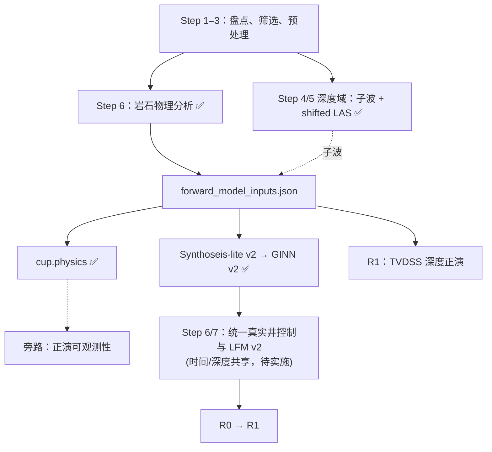

# 深度域正演能力重构设计

> 状态：阶段 1–3 已完成；阶段 4–5 待实施
> 范围：叠后、零偏移、声学正演 v1
> 当前工区：深度域地震，深度基准为 TVDSS，向下为正；井均为直井
> 本文记录已落地的设计决策和契约。若实现与本文冲突，应先修改本文并记录原因，不得通过静默兼容或兜底绕过契约。

## 1. 目标

在 `src/cup/physics/` 建立统一物理能力模块：同时支持时间域和深度域的正演内核，并承载域无关的岩石物理关系，供 Synthoseis-lite、GINN v2 和 R1 共同使用。正演可观测性分析是非阻塞旁路，不是统一正演内核及其下游的前置门禁；时间域工区持续运行既有 FFT/有限差分旁路，延期的只是深度域扩展。

重构后的核心性质：

- NumPy 与 PyTorch 后端提供同名、同语义 API。
- 时间域保留现有 Robinson 正演的数值语义。
- 深度域使用非平稳的纯深度域正演矩阵，不先把最终输出重采样到时间轴。
- 深度地震一律使用 TVDSS，单位为米，向下为正。
- 时间子波在时间域和深度域正演中都使用秒制时间轴。
- 核心内核只计算物理振幅，不填 NaN、不自动归一化、不施加 gain。
- 新实现不修改、不依赖 `src/ginn/`、`src/ginn_depth/` 中的遗留实现。

## 2. 非目标

本版本不处理：

- 叠前、角度道集、AVO/AVA 或各向异性；
- 斜井的 MD—TVDSS 轨迹变换；
- 上覆层绝对双程旅行时恢复；
- 深度域子波本身的定义或估计；
- 对遗留 `ginn`、`ginn_depth`、`wtie` 包进行迁移或清理；
- 读取旧 benchmark、checkpoint 或诊断产物并自动升级。

当前井均为直井，使用 `TVDSS = MD - KB`。未来支持斜井时，必须引入井轨迹并单独设计，不得沿用该等式。

## 3. 现状审计

### 3.1 重复的正演实现（重构前状态，阶段 1–3 已消除）

| 位置 | 重构前行为 | 重构后状态 |
|---|---|---|
| `src/cup/seismic/observability.py` | `convolve(mode="same")`，输出 `N-1` | 保留为时间域旁路，Synthoseis 已迁至统一后端 |
| `src/ginn_v2/real_field.py` | 输出 `N-1`，沿轴填非有限值 | 已迁至统一后端 ✅ |
| `src/ginn_v2/training.py` | PyTorch `conv1d`，输出 `N-1` | 已迁至统一 PyTorch 后端 ✅ |
| `src/wtie/modeling/modeling.py` | 偶数子波自动补零 | `wtie` 保持不动；新核心禁止复制该兜底 ✅ |
| `src/ginn/physics.py` | 遗留 PyTorch 反射率 | 仅作对照，不迁移 |
| `src/ginn_depth/physics.py` | 遗留深度域非平稳矩阵 | 重新实现于 `cup.physics`，不依赖遗留包 ✅ |

`wtie` 的 `(AI₂-AI₁)/(AI₂+AI₁)` 与本设计的 `tanh(ΔlogAI/2)` 数学等价。

### 3.2 核心域差异

深度域中，相同时间子波在不同速度和深度位置对应不同的米制宽度，正演算子随位置变化。因此时间域的平稳卷积、`twt_*` 命名和 `mode="same"` 裁剪契约不能直接搬到深度域。已通过统一正演内核分离两个域的算子构造（§4–5）。

### 3.3 坐标和几何（已修正）

- `survey.py` 的 `_domain_to_basis_type`：depth → `tvdss`（不再映射为 md）✅
- 深度界面反射率在内核中使用显式数组，不伪装成 TWT `grid.Reflectivity` ✅
- 体数据位置通过显式 iline/xline 轴和 `SurveyLineGeometry` 计算 ✅
- inline 步长 1、xline 步长 4：禁止 `line_number - first_line` 直接当下标 ✅

## 4. 物理与离散约定

### 4.1 轴、单位和形状

令：

- `log_ai[..., i] = ln(AI_i)`，最后一维长度为 `N`；
- `velocity_mps[..., i] = Vp_i`，单位 `m/s`，形状与 `log_ai` 相同；
- `depth_m[i] = z_i`，一维公共 TVDSS 轴，单位米，长度 `N`，严格递增；
- `wavelet_time_s[k]` 为规则采样的秒制子波时间轴，长度 `M`；
- `wavelet_amp[k]` 为子波振幅，长度 `M`。

批量维使用 `...` 表示。v1 中一批样本共享同一个一维深度轴和同一个时间子波。需要逐样本不同轴或不同子波时，应由调用方显式循环或在后续版本扩展 API，不做隐式广播猜测。

### 4.2 反射率

反射率挂在下部界面，即输出索引 `j` 表示样点 `j` 与 `j+1` 之间的界面：

```text
r[..., j] = tanh((log_ai[..., j+1] - log_ai[..., j]) / 2)
```

因此：

- 输入 `log_ai` 长度为 `N`；
- 输出反射率长度为 `N-1`；
- 不在头尾补零；
- 不把反射率伪装成与样点一一对应的 `N` 点数据。

### 4.3 统一正演输出维度

时间域和深度域共享同一套数组形状契约：

```text
logAI            N
reflectivity     N-1
W_time           N × (N-1)
W_depth          N × (N-1)
seismic          N
```

**时间域。** 显式定义事件时间轴 `event_twt_s[j] = twt_s[j+1]`，保留既有 Robinson
界面挂点语义。时间正演矩阵为：

```text
W_time[l, j] = w(twt_s[l] - event_twt_s[j])
s_time[l]    = Σ_j W_time[l, j] * r[j]
```

输出为 `N` 点。`s_time[1:]` 是按上述显式挂点定义得到的常规居中 Robinson
结果；当反射率道不短于子波时，它逐点复现旧 `N-1`
`convolve(r, wavelet, mode="same")`。当子波长于偶数长度的反射率道时，NumPy
的 `same` 裁剪存在一采样居中歧义，不再把该历史裁剪伪影作为基准。首点
`s_time[0]` 由有限子波支撑正常计算，不是补零。时间域训练不再需要"丢弃首样点"。

**深度域。** 沿用 §4.4–4.5 的非平稳算子，输出同样为 TVDSS 上的 `N` 点。
界面时间 `t_interface_j = 0.5 * (t_sample_j + t_sample_{j+1})`（相邻样点
累计 TWT 的中点）保持不变。深度域 TWT 非均匀，界面中点是最自然的物理近似，
且 `numpy_backend.py` 已按此约定落地；不改为 `t_sample_{j+1}`，以免引入
速度结构依赖的偏移并破坏已有深度域 fixture。

统一后时间域和深度域的消费契约完全一致：logAI、地震和 TVDSS/TWT 轴均为
`N` 点；反射系数和 `forward_valid_mask` 为 `N-1`；不再按域区分丢弃首点或
补零逻辑。时间域与深度域的界面时间约定分别服从各自物理约束（下界面 vs
中点），统一的是 shape 和消费端对齐规则，不是界面挂点本身。

统一正演矩阵的数值实现必须满足：
- 新时间 `N` 点输出的 `[1:]` 与当前 `src/cup/seismic/observability.py` 的
  有限输入 Robinson 结果逐点一致；
- NumPy 与 PyTorch 时间、深度结果分别在约定容差内一致，PyTorch 路径可微；
- 不改成界面中点挂点，避免给既有时间域结果引入半采样相移。

### 4.4 相对双程旅行时

深度正演只需要样点和界面的相对双程旅行时，不需要地震基准面到第一测井样点的绝对 TWT。

对每一深度区间，使用梯形慢度积分：

```text
Δz_i       = z_{i+1} - z_i
Δtwt_i     = 2 * Δz_i * 0.5 * (1 / v_i + 1 / v_{i+1})
t_sample_0 = 0
t_sample_i = Σ_{k=0}^{i-1} Δtwt_k
```

界面时间位于相邻样点累计 TWT 的中点：

```text
t_interface_j = 0.5 * (t_sample_j + t_sample_{j+1})
```

速度必须是有限正数。深度必须有限且严格递增。违反条件立即报错。

### 4.5 深度域非平稳正演

深度域算子定义为：

```text
W_depth[..., l, j] = w(t_sample[..., l] - t_interface[..., j])
d_depth[..., l]    = Σ_j W_depth[..., l, j] * r[..., j]
```

其中：

- `W_depth` 形状为 `[..., N, N-1]`；
- 输出 `d_depth` 形状为 `[..., N]`，与 TVDSS 深度样点严格对齐；
- `w(τ)` 由 `wavelet_time_s`、`wavelet_amp` 做一维线性插值得到；
- 超出子波时间支撑范围时振幅为 0；
- 不进行振幅阈值截断；
- 不自动归一化、不乘 gain、不做标准化。

默认按 64 个输出深度样点分块计算 `W_chunk @ r`，避免实体化完整矩阵。只有 `return_operator=True` 时才返回完整 `W_depth`。分块路径与完整矩阵路径必须数值一致。

### 4.6 时间子波契约

时间域和深度域使用相同的时间子波契约：

- `wavelet_time_s` 与 `wavelet_amp` 都是一维、有限且等长；
- 长度为奇数且至少为 3；
- 时间轴严格递增并规则采样；
- 中心样点的时间必须为 0；
- 不要求零相位；
- 不接受偶数长度后自动补零；
- 不在核心中自动重采样、归一化或移相。

“中心样点为零时刻”是坐标契约，不等于“中心振幅最大”或“子波零相位”。

### 4.7 AI—Vp 关系

工区级线性关系定义为：

```text
AI = a * Vp + b
Vp = (AI - b) / a
```

当前单位约定：

- `AI`：`m/s*g/cm3`；
- `Vp`：`m/s`；
- `a`：`g/cm3`；
- `b`：`m/s*g/cm3`。

必须满足 `a > 0`，并校验所有派生速度有限且大于 0。核心函数不猜测单位，不自动换算密度或阻抗单位。

该关系由 Step 6 在 Step 3 规则 MD 测井样点上拟合（已落地），数学上不依赖地震采样域，也不得为了拟合投影到 TWT。实井正演优先使用实测 Vp 和 Rho 构造 AI，同时把实测 Vp 作为传播速度；冻结的全工区 AI—Vp 关系主要服务于仅预测 logAI 的合成数据与模型推理闭环。

## 5. 目标包和公共接口 ✅ 已落地

实现位于 `src/cup/physics/`。NumPy 与 PyTorch 后端提供同名、同语义 API；
`__init__.py` 不无条件导入 PyTorch，保持 `cup` 基础使用场景的 PyTorch 可选。

### 5.1 包结构

```text
src/cup/physics/
├── __init__.py          # 导出 NumPy 后端函数 + AIVelocityRelation + rock_physics
├── numpy_backend.py     # NumPy 时间/深度内核
├── torch_backend.py     # PyTorch 同名内核，支持 autograd
├── adapters.py          # wtie.processing.grid ↔ 裸内核适配
├── calibration.py       # 冻结 AI–Vp 关系值对象，严格单位校验
└── rock_physics.py      # 域无关等井权 Huber 拟合，不读 LAS、不写产物
```

### 5.2 公共函数速查

所有函数在两个后端中签名、轴约定、返回形状和错误条件一致。详细签名以代码为准。

| 函数 | 输入形状 | 输出形状 | 后端 |
|------|---------|---------|------|
| `reflectivity_from_log_ai` | `[..., N]` | `[..., N-1]` | NumPy / PyTorch |
| `forward_time` | log_ai `[..., N]` + wavelet | `[..., N]` | NumPy / PyTorch |
| `build_depth_operator` | velocity `[..., N]` + depth `[N]` + wavelet | `[..., N, N-1]` | NumPy / PyTorch |
| `forward_depth` | log_ai `[..., N]` + velocity `[..., N]` + depth `[N]` + wavelet | `[..., N]`（或 + operator） | NumPy / PyTorch |
| `ai_from_velocity` | velocity `[...]` + `a, b` | `[...]` | NumPy / PyTorch |
| `velocity_from_ai` | ai `[...]` + `a, b` | `[...]` | NumPy / PyTorch |

关键契约（不再在规范中逐函数展开，以代码实现为准）：

- `forward_time`：显式下界面挂点，输出 N 点。反射率道不短于子波时 `[1:]` 与 Robinson 卷积逐点一致，首点非补零。
- `forward_depth`：默认 64 输出点分块，不物化完整 `W_depth`；`return_operator=True` 时返回 `(seismic, operator)`。
- `log_ai` 与 `velocity_mps` 形状必须完全一致，不做可能掩盖数据错配的广播。`depth_m` 必须是一维且长度为 N。
- `ai_from_velocity` / `velocity_from_ai`：不截断负速度，不合法即报错。调用方必须先显式 `exp(log_ai)`，API 不猜测输入是 AI 还是 logAI。

### 5.3 grid 适配器

`adapters.py` 提供 `forward_time_log` 和 `forward_depth_log`，负责 `wtie.processing.grid` 对象与裸内核之间的显式适配。时间域要求 TWT basis，深度域要求 TVDSS basis；basis 类型和单位在进入核心前校验。深度界面反射率不得标注为 TWT `grid.Reflectivity`。

## 6. 严格失败规则 ✅ 已落地

以下规则已在 `numpy_backend.py` 和 `torch_backend.py` 的 `_validate_*` 函数中实现。核心与产物读取器禁止：插值/填充 NaN、猜测 CSV 字段语义、猜测单位、自动归一化/gain、自动把 MD 当 TVDSS、自动升级旧 schema、因形状”刚好可广播”接受错配输入。数据清洗和标定若确有需要，必须在上游以命名步骤显式执行并写入产物元数据。

## 7. 坐标、配置与几何 ✅ 已落地

- `survey.py`：`domain=depth` → `basis_type=tvdss`；`domain=time` → `basis_type=twt`。`_domain_to_basis_type()` 实现。
- `WorkflowConfig`（原 `TimeWorkflowConfig`，已全仓改名）：`seismic.domain` 必填（`time`/`depth`）；`depth` 时 `depth_basis=tvdss` 必填；`time` 时禁止 `depth_basis`。米制边界用 `_m` 后缀，秒制用 `_s`，错域立即报错。
- 直井 TVDSS 构造：`TVDSS = MD - KB`。
- 体数据：通过显式 iline/xline 轴和 `SurveyLineGeometry` 计算位置，禁止假设步长为 1。`zgy_inline_chunk_size` 仅影响 ZGY 读取策略。

## 8. 工作流迁移



Steps 4–6 产物契约：

| Step | 脚本 | 关键产物 |
|---|---|---|
| 4 | `scripts/vertical_well_auto_tie_depth.py` | 固定时间子波 |
| 5 | `scripts/wavelet_batch_synthetic_depth.py` | `shifted_preprocessed_las` / `shifted_filtered_las`、时移扫描、合成 QC |
| 旁路 | `scripts/rock_physics_analysis.py` | `forward_model_inputs.json`、AI–Vp 关系、逐井 QC |

旁路 岩石物理分析的 LAS 输入只来自 Step 3，不依赖井分层或 Step 4/5 标定结果。

### 8.1 旁路：正演可观测性分析

正演可观测性是持续存在的非阻塞旁路。时间域 FFT/频率探针继续运行；深度域 Jacobian/SVD 延期。旁路结果仅供 QC，不修改训练分布、损失权重或正演校准。

### 8.2 Synthoseis-lite v2 与 GINN v2 ✅

深度域与时间域共享 `synthoseis_lite_v2` schema，通过 `sample_domain` 分派。深度域仅开放 `field_conditioned` 套件。与 `cup.physics` 的接缝：深度生成调 `forward_depth`，时间域调 `forward_time`；模型 manifest 记录 domain、basis 和 `forward_model_inputs_sha256`。

### 8.3 Step 7、R0 与 R1

Step 6/7 的真实井控制、trend/proportional-kriging baseline、framework modifier、显式 variant 和 R0 接缝统一按 [`UNIFIED_REAL_FIELD_LFM_V2.md`](UNIFIED_REAL_FIELD_LFM_V2.md) 实施；禁止另建深度域专用 LFM 入口。R1 用冻结 a/b 和子波在 TVDSS 轴上生成 N 点合成深度地震；合成与观测轴逐点一致；相位扰动和米制深度平移独立扫描。

## 9. 产物与 schema 契约

### 9.1 `rock_physics_relation.json`

最小结构：

```json
{
  "schema": "rock_physics_relation_v1",
  "formula": "AI = a * Vp + b",
  "coefficients": {"a": 0.0, "b": 0.0},
  "units": {
    "ai": "m/s*g/cm3",
    "vp": "m/s",
    "a": "g/cm3",
    "b": "m/s*g/cm3"
  },
  "regression": {
    "method": "equal_well_weight_huber",
    "initial_estimator": "equal_well_weight_least_squares",
    "scale_estimator": "weighted_mad",
    "huber_delta_sigma": 1.345,
    "min_valid_samples_per_well": 100,
    "min_valid_wells": 3
  },
  "ai_consistency": {
    "rtol": 1e-5,
    "atol_mps_gcc": 1e-3
  },
  "candidate_wells": [],
  "accepted_wells": [],
  "rejected_wells": [],
  "source_preprocessed_las": [],
  "aggregate_qc": {}
}
```

该文件固定写在 `modules/ai_vp_linear/`。`candidate_wells` 来自 Step 3 全部 passed 井；`accepted_wells` 至少三口，`rejected_wells` 逐井记录原因。`source_preprocessed_las` 逐文件记录规范化路径和 SHA-256。产物还必须记录每井归一化总权重、拟合收敛信息、`a > 0` 校验和反算正速度校验。该文件自身的 SHA-256 写入 `forward_model_inputs.json`。

### 9.2 `forward_model_inputs.json`

该文件只在 `ai_vp_linear` 启用且成功后由 Step 6 生成，不允许人工拼装。Step 3 run 可以按标准规则自动发现；NW11 子波必须使用配置中的显式文件。最小结构：

```json
{
  "schema": "forward_model_inputs_v1",
  "sample_domain": "depth",
  "depth_basis": "tvdss",
  "wavelet": {
    "source_well": "NW11",
    "path": "",
    "sha256": "",
    "time_unit": "s",
    "sample_count": 0,
    "dt_s": 0.0
  },
  "ai_velocity_relation": {
    "path": "modules/ai_vp_linear/rock_physics_relation.json",
    "sha256": "",
    "formula": "AI = a * Vp + b",
    "a": 0.0,
    "b": 0.0,
    "ai_unit": "m/s*g/cm3",
    "vp_unit": "m/s",
    "a_unit": "g/cm3",
    "b_unit": "m/s*g/cm3",
    "accepted_wells": []
  },
  "source_runs": {
    "well_preprocess_dir": ""
  },
  "well_input_inventory_sha256": "",
  "source_preprocessed_las": []
}
```

Step 6 写出时必须验证关系文件中的 a/b、单位、实际合格井清单和哈希与嵌入摘要一致，并验证显式子波文件存在、规则采样、奇数长度且中心为零时刻。该文件自身 SHA-256 作为 `forward_model_inputs_sha256` 写入全部下游产物。任何源预处理 LAS、输入清单、关系产物或子波变化，都必须形成新的哈希；不得复用旧标识。

### 9.3 R1 摘要

R1 摘要升级为 v2，至少包含 domain、TVDSS/TWT 轴契约、来源哈希、正演输入哈希、子波相位与米制深度平移参数、轴严格一致校验和闭环指标。可观测性 probe 仅作可选 QC 引用。

## 10. 兼容策略

新代码继续支持时间域计算，但不兼容旧的 benchmark、checkpoint 和诊断产物。

读取到以下旧产物时必须报出 schema、实际版本、期望版本和重建命令/指南入口：

- `synthoseis_lite_v1` 或无 schema 的合成数据；
- `ginn_v2_model_run_v2` 及更早模型；
- R1 v1 或无 domain/正演输入哈希的摘要；
- 无明确 TWT/TVDSS 单位轴的中间产物。

禁止：

- 根据字段存在性静默推断版本；
- 为旧 checkpoint 注入默认 domain；
- 为旧深度数据补一个虚构的正演输入哈希；
- 保留旧 `forward_log_ai` 名称作为兼容包装。

工区专用 Step 4/5 已完成并继续调用 `wtie`，但不作为 `cup.physics` 的数值内核依赖。`src/wtie/`、`src/ginn/`、`src/ginn_depth/` 保持原样；NumPy/PyTorch 数值后端不得导入它们。`adapters.py` 可以显式适配 `wtie.processing.grid`；`ginn` 与 `ginn_depth` 仅用于对照和 fixture 生成。

## 11. 实施顺序与提交门禁

### 阶段 1–3 ✅ 已完成

- 阶段 1：Step 4/5/6 脚本与 `src/cup/physics/` 内核。
- 阶段 2：`survey.py` TVDSS 修正、`WorkflowConfig` 改名及 domain/depth_basis 严格配置、NumPy/PyTorch 双后端、分块正演、grid 适配器、AI–Vp 变换、`forward_model_inputs.json` 统一读取。
- 阶段 3：Synthoseis-lite v2 depth 分支（`field_conditioned` 套件）、GINN v2 physics loss 迁至统一后端。

门禁均通过：双后端数值一致、gradcheck、分块与完整算子一致、错域/NaN/旧 schema 明确失败。

### 阶段 4：Step 6/7 统一真实井控制与 LFM v2（已实施，待本地测试）

按 [`UNIFIED_REAL_FIELD_LFM_V2.md`](UNIFIED_REAL_FIELD_LFM_V2.md) 实施。门禁：时间/深度域共享 canonical WellControlSet、baseline builder 和 framework modifier；多个显式 variant 同网格同掩码、来源可追溯；不新增深度域专用脚本或编号式 baseline/scenario 接口。

### 阶段 5：R0/R1 与重复实现清理（R0 已切 v2；R1 深度闭环待实施）

Step 7/R0 携带 domain 和正演输入哈希；R1 迁移到 v2 深度闭环；全仓删除重复 `forward_log_ai`/`_torch_forward_log_ai`。门禁：新生产正演只经过 `cup.physics`。

## 12. 测试规范

测试由实现方编写，用户在本地环境运行。至少覆盖：

1. 新时间 `N` 点输出符合显式下界面算子；反射率道不短于子波时 `[1:]` 与
   当前 Robinson 正演逐点一致；短道不继承 NumPy `same` 的偶数长度裁剪歧义；
   首点非补零。
2. NumPy/PyTorch 时间（`N` 点）和深度（`N` 点）结果分别一致。
3. 分块深度结果与完整 `W_depth` fixture 一致；`return_operator` 两条路径 shape 正确。
4. PyTorch 对 logAI 和速度分别通过双精度 `gradcheck`。
5. 常速度模型满足解析相对 TWT、界面时间和矩阵权重预期。
6. 子波线性插值在节点、节点中点和支撑区外行为正确。
7. 非有限值、非正速度、非递增深度、偶数/非规则子波、错域和错单位输入均明确失败。
8. 数据集、模型、R1 对旧 schema 和错正演输入哈希明确失败。
9. R1 深度合成、观测与 TVDSS 轴逐点严格一致且均为 `N` 点；相位扰动与米制深度平移相互独立。
10. inline 步长 1、xline 步长 4 的体采样集成测试。

测试容差必须按 dtype 和运算路径显式设置，不能通过放宽全局容差掩盖核翻转、界面对齐、半样点偏移或鲁棒回归不收敛。

## 13. 验收标准

本重构完成需同时满足：

- `src/cup/physics/` 是新通用工作流唯一的正演和岩石物理实现来源；
- `forward_time` 输出 `N` 点，遵循显式下界面挂点；常规长度下 `[1:]` 复现
  既有 Robinson 结果，首点非补零；
- `forward_depth` 输出 TVDSS 上 `N` 点，分块/完整、NumPy/PyTorch 一致；
- 时间域和深度域共享同一套 logAI（`N`）、反射率（`N-1`）、地震（`N`）形状契约；
- Step 6/7 按统一真实工区 LFM v2 规范实施；生产运行仍须通过用户本地测试和真实数据验收；
- xline 步长 4 不造成位置偏移或错误索引；
- 所有旧 schema 均以可操作错误要求重建，不被静默读取；
- 核心没有 NaN 填充、自动归一化、gain 或单位猜测；
- 遗留 `wtie`、`ginn`、`ginn_depth` 未被修改或变成新核心依赖。

深度域 Jacobian/SVD 正演可观测性扩展不属于本轮验收条件；时间域旁路不被删除或暂停。

## 14. 主要风险与控制

| 风险 | 表现 | 控制 |
|---|---|---|
| 可选 probe 污染训练 | 诊断结果改变训练分布或损失 | probe 分库、独立 manifest；训练数组内容哈希不变测试 |
| 界面半样点错位 | 合成事件系统性偏移 | 明确下部界面和界面 TWT 中点；解析测试 |
| PyTorch 卷积核方向错误 | 时间后端与 NumPy 相位相反 | 固化非对称子波 fixture |
| 深度矩阵内存过大 | 批量训练 OOM | 默认 64 输出点分块，仅显式请求完整算子 |
| 时间相位与深度静差混淆 | 场景不可解释 | 秒制子波扰动和米制平移使用独立字段及扫描 |
| 旧产物混入新模型 | domain 或校准不可追溯 | schema 和 SHA-256 严格校验，不提供自动升级 |
| 线号当数组下标 | xline 步长 4 时取错道 | 显式轴 + `SurveyLineGeometry` + 集成测试 |

该设计的核心边界是：时间子波属于时间坐标，地震输出属于声明的采样域；速度场通过相对旅行时把二者连接起来。任何试图用样点数、文件名或未记录的”最新运行”替代坐标、单位、domain 和来源哈希契约的实现，都不符合本规范。
