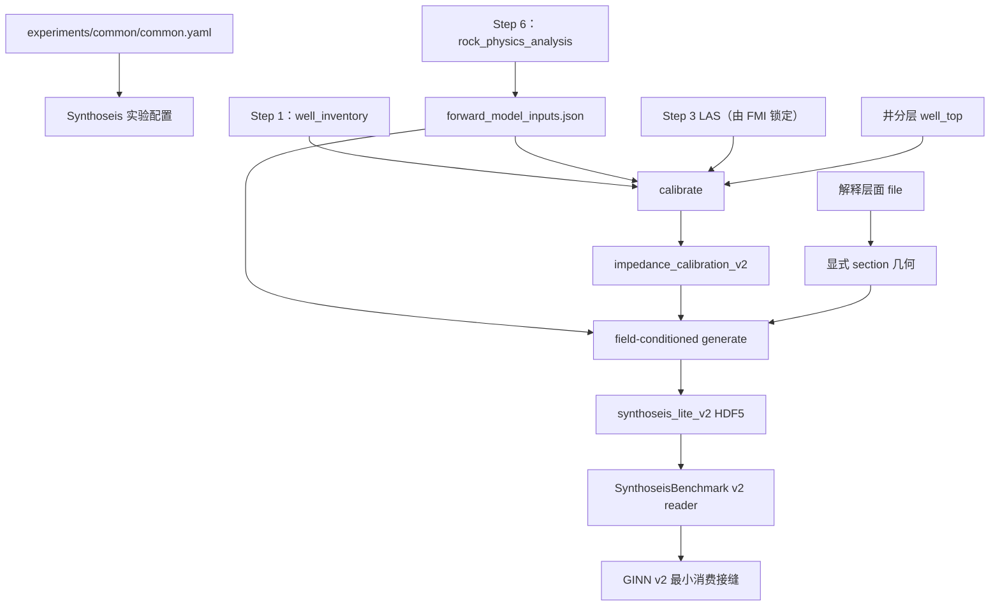

# 深度域 Synthoseis-lite v2 设计规范

> 状态：首轮代码已实现，待用户分阶段验证
> 适用范围：叠后、零偏移、声学、二维 field-conditioned 合成数据  
> 当前工区：深度域、TVDSS 向下为正、模型采样间隔 5 m、井均为直井  
> 本文是深度域 Synthoseis-lite 的唯一实施规范。`DEPTH_DOMAIN_FORWARD_REFACTOR.md`
> 不再承载本旁路的详细设计。

## 1. 目标与边界

在保留现有 Synthoseis-lite 模块化入口和无量纲随机地质生成核心的前提下，
新增严格的深度域 calibrate、field-conditioned generate、HDF5 writer、reader
以及 GINN v2 最小消费契约。

本版本必须满足：

- 深度地震、目标和辅助真值均位于显式 TVDSS 米制轴；
- 时间子波始终保留秒制时间轴，通过 Vp 与 TVDSS 建立相对旅行时；
- 深度正演只调用 `cup.physics`，不得调用遗留 `ginn`、`ginn_depth` 或重复实现；
- 高分辨率正演产生默认网络输入，模型网格正演提供精确 physics-loss 参考；
- 合成数据不依赖正演可观测性旁路、Step 4/5 运行目录或 shifted LAS；
- 所有来源、domain、单位、轴、shape 和 SHA-256 可追溯；
- 旧 v1 benchmark 不做静默升级。

本版本不规定：

- GINN v2 的网络结构、patch 大小、训练循环、checkpoint 或模型 manifest；
- 深度 canonical benchmark；
- 深度波数 probe benchmark；
- 三维合成体、叠前/AVO、各向异性或斜井；
- Step 7 的深度 LFM 数据来源。

时间域仍保留现有 TDT 投影、filtered/full AI 校准、Robinson 正演、canonical
和 Hz probe 语义。时间域与深度域共享 v2 产物契约和无量纲对象生成核心，
但不得伪装成同一种数据准备过程。

## 2. 总体数据流



Step 6 的 `forward_model_inputs.json` 是 AI–Vp 关系和 NW11 时间子波的唯一
装配来源。Step 3 run 由该文件锁定；Synthoseis 不独立发现另一个 Step 3 run。

## 3. 配置与来源契约

### 3.1 配置组合

`experiments/synthoseis_lite/synthoseis_lite.yaml` 不再复制完整工区配置，最小形态为：

```yaml
workflow_config: experiments/common/common.yaml

synthoseis_lite:
  sample_domain: depth
  benchmark_schema: synthoseis_lite_v2
  global_seed: 20260615
  source_runs:
    well_inventory_dir:
    rock_physics_analysis_dir:

  sampling:
    expected_model_dz_m: 5.0
    vertical_oversampling_factor: 8
    antialias:
      family: zero_phase_fir_kaiser
      taps_per_factor: 32
      cutoff_output_nyquist_fraction: 0.90
      kaiser_beta: 8.6

  geometry:
    lateral_sample_interval_m: 25.0
    field_conditioned:
      enabled: true
      target_zone:
        mode: filled_target_zone

  sections:
    - section_id: explicit_depth_section
      path:
        - {inline: 1600.0, xline: 4200.0}
        - {inline: 1800.0, xline: 6200.0}

  calibration:
    background_estimator: per_well_zone_huber
    huber_delta_sigma: 1.345
    minimum_valid_cells_per_well_zone: 3

  impedance_attribute_generator:
    family: object_coefficients_v2
    state_threshold_sigma: 1.0
    sensitivity_threshold_sigmas: [0.75, 1.25]
    minimum_calibration_object_cells: 2
    duration_modes:
      standard:
        minimum_highres_cells: 4

  generation:
    attempts_per_scenario: 20
    duration_modes: [standard]
    geometry_families: [none, wedge, pinchout]
    geometry_directions: [left_to_right, right_to_left]
    acceptance_qc:
      minimum_attempts_per_scenario: 20
      warning_fraction: 0.80
      failure_fraction: 0.50

  splits:
    assignment_unit: parent_realization
    held_out_geometry_family: pinchout

  lfm:
    enabled: true
    ideal:
      minimum_wavelength_m: 250.0
      numtaps: 129
      kaiser_beta: 8.6
    controlled_degraded:
      minimum_wavelength_m: 400.0
      numtaps: 129
      kaiser_beta: 8.6

  seismic_mismatch:
    enabled: true
    wavelet:
      phase_rotation_degrees: [-10.0, 10.0]
      time_shift_s: [-0.001, 0.001]
    depth_static:
      shift_m: [-2.5, 2.5]
    noise:
      white_noise_rms_fraction: 0.05
      colored_noise_rms_fraction: 0.05
      colored_vertical_correlation_m: 25.0
    gain:
      global_log_sigma: 0.15
      tracewise_log_sigma: 0.15

  canonical:
    enabled: false
  probe_selection:
    enabled: false
```

`workflow_config` 相对仓库根目录解析。实验文件只允许提供
`synthoseis_lite` 段，不得覆盖 `data_root`、`output_root`、`assets`、
`seismic`、`target_interval`、`well_curves` 或 `spatial_debias`。发现这些重复字段
必须报错，而不是按合并顺序决定优先级。

section 内不允许 `resample_interval_m` 等局部采样字段；横向采样间隔只有
`geometry.lateral_sample_interval_m` 一个来源。当前值固定为 25 m。

深度 v2 第一版只实现 `standard` duration mode。`minimum_highres_cells`、状态阈值、
敏感性阈值和 acceptance QC 必须由已解析配置进入 calibration/generate manifest，
不得继续散落为调用点中的数字字面量。`0.75/1.25` 只用于校准敏感性 QC，不扩展为
额外生成分布。请求 `ultra_thin_stress` 或未知 mode 必须明确失败；以后启用新 mode
时同时定义其最小高分 cell 数，并升级 generator family 或 schema。

### 3.2 层位三重语义

common 配置必须显式声明稳定内部 ID、井分层名和解释层面文件：

```yaml
target_interval:
  horizons:
    - name: base_of_salt
      well_top: BVE100_TOP
      file: interpre/base_of_salt_extend
    - name: base_of_bve
      well_top: ITP_TOP
      file: interpre/base_of_bve_extend
    - name: base_of_itp
      well_top: ITP_BOT
      file: interpre/base_of_itp_extend
```

- `name`：校准产物、zone ID 和下游输出使用的稳定内部 ID；
- `well_top`：`data/raw/well_tops` 中的 `Surface`；
- `file`：地震解释层面文件。

禁止用任一字段猜测另外两个字段。层位顺序按配置从浅到深冻结，generate
必须逐项验证当前配置与校准产物完全相同。

### 3.3 run 发现与闭环

`source_runs` 的两个键分别解析：每个空值独立采用 `resolve_source_run()` 发现最新合格
run，每个非空值严格使用显式目录。因此允许 Step 1 显式固定、Step 6 自动发现，或反之；
不得仅在整个 `source_runs` 为空时才统一回退。显式目录存在但不合格时直接失败，不能再
退回自动发现。

必需来源：

| 来源 | 必需文件 | 关键校验 |
|---|---|---|
| Step 1 | `well_inventory.csv`、`run_summary.json` | 当前 common、depth domain、显式 iline/xline 和井坐标 |
| Step 6 | `forward_model_inputs.json`、`run_summary.json` | `status=success`、`sample_domain=depth`、`depth_basis=tvdss` |
| Step 3 | 由 forward manifest 引用 | passed LAS 路径和 SHA-256 逐文件一致 |
| 井分层 | common 的 `assets.well_tops_file` | 文件存在、哈希固定、井名与 Surface 唯一 |
| 解释层面 | common 的 `target_interval.horizons[*].file` | 文件存在、哈希固定、line 坐标支撑有效 |

必须重新计算并验证 forward manifest 中关系文件、时间子波、输入清单和逐井 LAS
的 SHA-256。任何不一致立即失败。calibrate 和 generate 的所有 summary、manifest
均记录 `forward_model_inputs_sha256`。

每个来源还必须记录 `resolution_mode=explicit|auto`、最终规范化路径、run schema、
`run_summary.json` 哈希和用于判定“合格”的必需文件。自动发现不是无痕的便利逻辑；
它只替用户选择当前最新合格 run，产物仍冻结解析后的具体目录和哈希。

不再接受或自动发现：

- `forward_observability_dir`；
- `well_auto_tie_dir`；
- `wavelet_generation_dir`；
- Step 5 shifted LAS 或 cluster 表。

空间去偏从 Step 1 的井口坐标按 common 的 `cluster_radius_m=600` 重新计算。
每口单井也必须获得独立 cluster ID，不能因为 `well_clusters.csv` 只列多井簇而遗漏。

## 4. 深度 calibrate

### 4.1 井曲线与轴

候选井来自 forward manifest 锁定的全部 Step 3 passed LAS。每口井同时必须存在于
Step 1 inventory，并具有有限的 `kb_m`、`inline_float` 和 `xline_float`。

当前井均为直井：

```text
tvdss_m = md_m - kb_m
log_ai = ln(AI [m/s*g/cm3])
```

不得使用井震标定时移、shifted LAS、TDT 或解释层面去移动井曲线。

### 4.2 逐层贡献

井曲线分层只使用 `well_top`。相邻两个井顶均存在、唯一、有限且顺序正确时，
该井才向对应 zone 贡献数据。缺少一个井顶只使相关 zone 不可用，不整井拒绝。

因此 NW8 可以贡献 `BVE100_TOP → ITP_TOP`，但不贡献缺少 `ITP_BOT` 的下一层。
若一口井没有任何有效 zone，则该井以 `no_valid_well_zones` 拒绝。每个最终 zone
必须满足校准模块既有的最少井/簇证据规则，否则明确失败或按现有、已记录的
parent-prior 收缩规则处理，不新增静默兜底。

### 4.3 米制 cell average 与缺口

模型采样间隔从真实地震 TVDSS 轴读取并验证为 5 m；高分校准间隔为：

```text
truth_dz_m = model_dz_m / vertical_oversampling_factor = 0.625 m
```

在每个井 zone 内：

1. 识别 AI 的连续有限正值 run；
2. 在 0.625 m cell 上对 `log(AI)` 做分段线性积分平均；
3. 只有 cell 左右边界均位于同一连续 run 内时才写值；
4. 不跨 NaN、长缺口或不同 run 插值；
5. 不裁异常、不自动归一化、不填边界。

一个井 zone 至少需要 3 个有效 cell。少于该值时只拒绝该井 zone并记录
`insufficient_valid_cells`。

### 4.4 Huber 背景与对象识别

深度域不再需要 filtered/full 双曲线。每个井 zone 在归一化层内坐标上拟合：

```text
zeta = (tvdss - zone_top) / (zone_bottom - zone_top)
background_log_ai = a + b * (2*zeta - 1)
```

拟合使用 Huber IRLS：

- 等 cell 基础权重；
- OLS 初值；
- MAD 稳健尺度；
- 阈值 `1.345σ`；
- 系数有限且收敛，否则拒绝井 zone。

`observed_log_ai - background_log_ai` 进入现有三态阈值、短态合并、对象轮廓
`c0/c1/c2`、持续比例、转移矩阵、层级权重和横向随机场校准。下列无量纲语义
保持不变：

- zone 内 `zeta`；
- object 内 `xi`；
- 对象厚度占 zone 的比例；
- 状态方向与转移概率；
- 轮廓投影、反转和 clipping QC。

深度校准产物必须记录：

```text
sample_domain = depth
depth_basis = tvdss
vertical_axis_unit = m
truth_dz_m = 0.625
background_estimator = per_well_zone_huber
```

校准同时冻结每个 zone 和全局的 `generation_log_ai_bounds`。它们取自完成层级收缩后的
zone AI P01/P99，并作为生成器允许的硬包络，而不是从某次随机 realization 事后统计：

```text
generation_log_ai_bounds.per_zone.<zone_id>.minimum
generation_log_ai_bounds.per_zone.<zone_id>.maximum
generation_log_ai_bounds.global.minimum
generation_log_ai_bounds.global.maximum
```

对象轮廓、背景以及目标区外的背景延拓都必须位于对应 zone 包络内；生成器通过既有
系数条件化满足约束，无法满足时拒绝 realization，不在最终数组上静默 clip。全局上下界
分别是全部 zone 显式下界的最小值和上界的最大值。

calibration QC 必须为每口井、每个有效 zone 保存 observed logAI、Huber 背景线、残差、
IRLS 权重和 layer-coordinate `zeta` 对比图，并在 `well_background_fits.csv` 记录 RMSE、
MAE、MAD scale、最大绝对残差和按 `zeta` 分箱的残差中位数。线性 Huber 是 v2 第一版
冻结模型；这些诊断用于识别系统性曲率，但不得在同一 schema 下自动切换二次背景。

时间域 v2 则记录 `background_estimator=time_filtered_full_ai`，继续使用现有 TDT
和 filtered/full AI，不因深度适配改变既有统计分布。

### 4.5 井顶—解释层面一致性审计

calibrate 新增 `well_horizon_consistency.csv`。解释层面只能在 Step 1 inventory
给出的 `inline_float/xline_float` 上通过 `HorizonSurface.sample_at_line()` 采样；
禁止直接用井头 XY 与解释文件 XY 做最近邻，因为二者可能使用不同坐标表达。

固定字段：

| 字段 | 语义 |
|---|---|
| `well_name` | 井名 |
| `horizon_name` | 稳定内部 ID |
| `well_top_surface` | Petrel 井顶名 |
| `inline_float` / `xline_float` | Step 1 井位 line 坐标 |
| `well_top_md_m` / `well_top_tvdss_m` | 井顶 MD 与 `MD-KB` |
| `interpreted_tvdss_m` | 解释层面采样值 |
| `delta_interpretation_minus_well_top_m` | 两套证据差值 |
| `sample_method` / `support_status` | exact、bilinear 或已有支撑方法 |
| `status` / `reason` | 审计状态 |

数值差异只报告分布，不设 warning/fail 米制阈值，也不用于移动、拉伸或混合井曲线。
以下结构错误必须失败：

- `name/well_top/file` 任一缺失；
- 配置内部 ID 重复或层序交叉；
- 解释层面在候选井 line 位置无允许的支撑；
- 井顶存在但 MD/TVDSS 非有限或同名值冲突。

## 5. 深度 field-conditioned generate

### 5.1 套件范围

深度 v2 第一版只允许：

```text
suite = field_conditioned
geometry_family = none | wedge | pinchout
```

`canonical.enabled` 和 `probe_selection.enabled` 必须显式为 `false`。深度运行请求
canonical、frequency probe、Hz probe 或可观测性来源时立即失败。时间域不受此限制。

### 5.2 section 几何

section 使用显式 inline/xline 折线。路径点可为浮点线号，但必须位于 survey footprint
和全部解释层面支撑内。横向重采样统一为 25 m。

全部位置计算通过：

1. survey 的显式 inline/xline 轴；
2. `SurveyLineGeometry.line_to_coord()` / `coord_to_line()`；
3. `HorizonSurface.sample_at_line()`；
4. `TargetZone` 的显式 step 和 mask。

不得使用 `(xline - xline_min)` 直接作为数组下标。运行时不得断言 inline/xline
步长为 1、4 或任何工区常量；当前工区的 inline 步长 1、xline 步长 4 只是一组必须覆盖
的回归 fixture。

运行时几何校验按以下通用契约执行：

1. SEG-Y/ZGY adapter 从文件元数据或显式格式参数构造
   `LineAxis(minimum, step, count)`；`step` 必须有限且在多线轴上非零，`count > 0`；
2. 轴值始终由 `minimum + index * step` 构造，线号到浮点 index 始终由
   `LineAxis.index_of_line()` 完成；整数数组下标只允许由该浮点 index 经过调用方明确的
   exact/snap/interpolation 规则得到；
3. 对 survey 四角、section 顶点和重采样点检查
   `line → XY → line` 与 `XY → line → XY` 双向闭合，容差依据浮点精度和实际 bin 米制
   尺度设置，不依据线号步长写死；
4. 相邻 index 的线号增量必须等于 adapter 报告的对应 step，相邻道中心 XY 增量必须等于
   `SurveyLineGeometry` 的对应 affine increment；线号增量不得被解释为数组下标增量或米；
5. `TargetZone`、解释层面和地震体的数组 shape、轴端点及轴方向必须与各自显式轴一致。
   解释层面允许支撑稀疏，但采样必须通过其自身轴和 `sample_at_line()`，不得借用地震体
   的步长猜 index；
6. section 每个输出点必须位于 survey footprint 和所有必需层面的允许支撑内，且 QC
   写出实际 `inline_step`、`xline_step`、浮点 line、浮点 index、采样方法和支撑状态。

测试至少包含两类人工规则几何：单位步长 fixture，以及 inline 步长 1、xline 步长 4
的非单位步长 fixture；还需用另一组非单位步长证明实现没有针对 4 分支。生产校验只比较
数据与其自身显式轴是否闭合，不与这些 fixture 的数值比较。

### 5.3 TVDSS 模型轴和高分轴

模型轴必须是实际地震 TVDSS 轴的连续子集，不能仅保证间隔相同：

```text
tvdss_model_m ⊂ survey.samples
dz_model = 5 m
n_highres = (n_model - 1) * 8 + 1
dz_highres = 0.625 m
tvdss_highres_m[::8] == tvdss_model_m
```

上述两条轴覆盖的是“目标层段 + 全部上下 context”的完整生成窗，不是仅覆盖目标层段。
先将目标层段上下边界向外扩展 `context_m`，再分别向外吸附到实际 survey TVDSS 模型
样点，由吸附后的首尾模型样点一次性构造整条 `tvdss_model_m`；随后只在每对相邻模型
样点之间插入 7 个高分点，构造唯一连续的 `tvdss_highres_m`。禁止为上 context、目标区、
下 context 分别建轴后拼接。因而 context 边界必定落在模型网格点，嵌套关系在完整窗口
内成立，且 `n_model >= 2`；不能形成至少一个模型区间时明确失败。

上下文使用完整时间子波支撑，而不是振幅阈值截断：

```text
wavelet_half_support_s = max(abs(wavelet_time_s))
physics_halo_m = ceil_to_model_grid(
    0.5 * maximum_allowed_vp_mps * wavelet_half_support_s
)
context_m = physics_halo_m + antialias_filter_half_width_m
```

`maximum_allowed_vp_mps` 不从对象系数临时反推，而只从校准产物的显式全局生成上界和
冻结 AI–Vp 关系计算：

```text
maximum_generated_ai = exp(generation_log_ai_bounds.global.maximum)
maximum_allowed_vp_mps = (maximum_generated_ai - b) / a
```

结果必须有限、为正，并写入 calibration 与 benchmark manifest。目标层段加完整 context
后若不能落在实际 survey TVDSS 轴内，section 失败，不得缩短子波或减少 halo。

目标区外 context 延续相邻边界的 background logAI，并由同一冻结关系派生 Vp。
context 不进入目标有效 mask，但参与正演。

抗混叠 FIR 与第 6 节 LFM 是两套独立滤波器。高分地震降到模型网格固定使用
`sampling.antialias`：

```text
factor = vertical_oversampling_factor
numtaps = taps_per_factor * factor + 1       # factor=8 时为 257，必须为奇数
normalized_cutoff_on_highres_nyquist =
    cutoff_output_nyquist_fraction / factor
antialias_filter_half_width_m =
    ((numtaps - 1) / 2) * dz_highres_m
```

滤波器为 `scipy.signal.firwin(..., window=("kaiser", kaiser_beta), scale=True)` 生成的
零相位对称 FIR。只对拥有完整物理 context 的区间卷积并按与模型轴重合的高分 index
抽取；不得靠 edge/line/constant padding 外推缺失 context。manifest 保存全部参数、实际
taps、SciPy 版本和 taps SHA-256。LFM 的 250 m/400 m 最小波长参数不得复用于此滤波器。

### 5.4 两级 AI–Vp 派生

高分与模型网格分别派生速度：

```text
ai_highres = exp(log_ai_highres)
vp_highres_mps = (ai_highres - b) / a

model_target_log_ai = antialias_downsample(log_ai_highres)
ai_model = exp(model_target_log_ai)
vp_model_mps = (ai_model - b) / a
```

禁止把 `vp_highres_mps` 下采样后当作 `vp_model_mps`。任何非有限或非正速度使
realization 失败。生成 AI 超出 Step 6 拟合样本 AI 范围时记录外推比例，但不裁剪；
校准自身的显式 AI bounds 仍按现有对象生成规则执行。

### 5.5 NumPy 带状深度正演

`cup.physics.numpy_backend.forward_depth(..., return_operator=False)` 增加精确带状路径。
相对 TWT 和界面 TWT 严格递增，因此对输出样点 `l` 只计算满足以下条件的界面：

```text
wavelet_time_min_s
<= sample_twt_s[l] - interface_twt_s[j]
<= wavelet_time_max_s
```

界面范围通过单调轴 `searchsorted` 获得；范围内仍使用与完整矩阵相同的线性子波插值。
该优化只删除理论上严格为零的权重，不近似、不截幅、不按振幅阈值缩短子波。

- `return_operator=True` 和 `build_depth_operator()` 保留完整矩阵；
- NumPy 高分生成默认使用带状路径；
- PyTorch 短 patch 保留当前完整、可微权重路径；
- dense、banded、chunk-size 变化必须在显式 dtype 容差内一致。

### 5.6 双地震契约

每个 base realization 生成：

1. 在 `tvdss_highres_m` 上调用带状 `forward_depth`；
2. 对高分地震做有记录的空间抗混叠并采样到 `tvdss_model_m`，得到
   `seismic_observed`；
3. 在 `model_target_log_ai + vp_model_mps + tvdss_model_m` 上再次调用
   `forward_depth`，得到 `seismic_model_consistent`；
4. 计算：

```text
subgrid_forward_residual = seismic_observed - seismic_model_consistent
```

职责固定为：

| 数组 | 用途 |
|---|---|
| `seismic_observed` | GINN v2 默认网络输入；包含高分子网格正演效应 |
| `seismic_model_consistent` | 模型网格精确闭合参考和 physics-loss 目标 |
| `subgrid_forward_residual` | 尺度差异 QC，不作为新的监督目标 |

`forward_depth(model_target_log_ai, vp_model_mps, tvdss_model_m, ...)` 重算结果必须
与 `seismic_model_consistent` 在 float64 的显式逐点容差内闭合。高分 observed 与
model-consistent 的 RMS、NRMSE、相关性、振幅尺度和深度波数谱形状只报告，
第一版不设置数值门禁。

完整高分地震在写出 5 m observed 和 QC 后释放，不写入 HDF5。必须记录：

- 高分地震数组 SHA-256；
- 带状算法版本、chunk 和 dtype；
- 子波路径、时间轴及 SHA-256；
- 抗混叠 FIR 参数和系数 SHA-256；
- 高分/模型轴及 Vp 范围；
- 下采样前后 RMS 与闭合 QC。

### 5.7 attempt、接受率与评估角色

generate 不再冻结 train/validation/test 比例。生成端只负责冻结父样本身份和
评估角色；训练端按 parent 派生普通 split。原因是 train/validation 比例属于模型训练
配置，若写死在 benchmark 里，每次调整比例都要重建 HDF5，维护成本和实验成本都过高。

防泄漏约束仍然位于 parent seam：同一 `parent_realization_id` 的 base、LFM、
seismic mismatch variant 和后续 patch 不允许跨 split；这个约束由训练端按 parent hash
派生 split 时保证。

generate 在计算任何随机地质之前先物化不可变的 `attempt_plan.csv`。每行至少包含：

```text
parent_realization_id
section_id
scenario_id
geometry_family
geometry_direction
duration_mode
attempt_id
evaluation_role
```

`parent_realization_id` 与 `attempt_id` 在配置和 global seed 不变时必须稳定。随机数继续使用
现有 SHA-256 命名流和 `PCG64DXSM`。manifest 冻结 seed 派生字段顺序、算法版本和
允许的 `stream_purpose` 注册表。新增图件或 QC 不得改变既有 realization 的随机数。

评估角色规则固定为：

1. `assignment_unit` 只能是 `parent_realization`；
2. held-out geometry family 来自配置，不得在代码中写死 `pinchout`；
3. held-out family 的全部父 realization 标记为 `evaluation_role=geometry_holdout`；
4. 其他父 realization 标记为 `evaluation_role=development_pool`；
5. base、其所有 mismatch variant 以及未来由它裁出的全部 patch 必须继承同一
   `parent_realization_id` 和 `evaluation_role`；
6. generate 过程中不得因拒绝率或 split 数量不足动态追加 attempt/seed。

`attempt_plan.csv` 是计划，不在生成后改写接受状态。实际 `ok/rejected`、原因和接受数
写入 `generation_qc.csv` 与 `scenario_catalog.csv`。每个 scenario 至少评估 20 次：
接受率低于 0.50 整次 generate 失败，位于 `[0.50,0.80)` 记 warning。manifest 报告
`development_pool` 与 `geometry_holdout` 的父样本数。

patch 裁取仍留给 GINN v2 训练专项设计，因为 patch 尺寸、stride、halo 和随机采样策略
属于模型消费方式。训练端 `split_policy=derive` 按 `parent_realization_id` 哈希派生
train/validation/test；`geometry_holdout` 永远进入 test。改变 train/validation/test
比例只重建 patch index 和 normalization，不改变 HDF5 benchmark。

## 6. 深度 LFM

LFM 从 5 m `model_target_log_ai` 派生，shape 与目标完全相同。深度域配置只接受
米制最小波长：

| LFM | `minimum_wavelength_m` | 空间截止波数 |
|---|---:|---:|
| ideal | 250 m | `1/250 cycles/m` |
| controlled degraded over-smoothing | 400 m | `1/400 cycles/m` |

滤波器使用 5 m 规则轴和显式 Kaiser FIR；截止波数必须位于 `(0, Nyquist)`。
HDF5 和 QC 以 `minimum_wavelength_m` 为权威字段，不能只保存换算后的无单位比例。

深度配置及产物统一使用：

- `linear_vertical_trend_sigma_log_ai`；
- `vertical_width_fraction`；
- `vertical_correlation_fraction` 或明确的 `*_correlation_m`。

禁止出现 `cutoff_hz`、`linear_twt_trend`、`twt_width_fraction` 或把 Hz 通过样本速度
动态换算成 LFM 尺度。时间域继续使用原 Hz 字段。

## 7. 深度 seismic mismatch

### 7.1 通用变体

白噪声、米制纵向相关有色噪声、全局正增益、逐道正增益和纵横平滑正增益可复用
现有随机流与 RMS 归一化规则，但字段由 `time_*` 改为 `vertical_*`。所有增益严格
为正，所有噪声只在变体有效 mask 内定标。

### 7.2 时间子波变体

相位与时间平移属于时间子波，不直接作用于深度地震数组：

- 相位：`-10°`、`+10°`；
- 时间平移：`-0.001 s`、`+0.001 s`；
- 平移使用规则秒制子波轴线性插值，支撑外为零；
- 每个扰动子波必须保持有限、奇数长度、规则时间轴和中心零时刻契约；
- 扰动后重新执行高分带状深度正演和抗混叠下采样。

禁止对 `seismic_observed` 直接做 Hilbert 相位旋转来冒充深度域子波相位场景。

### 7.3 米制深度静差

深度静差只作用于最终 5 m observed：

```text
shift_m = -2.5 m | +2.5 m
shifted(z) = seismic_observed(z - shift_m)
```

使用 TVDSS 轴线性插值；轴外不得外推或复制边界。静差后同步更新 variant valid mask，
被移出原支撑的样点为无效。时间子波 shift 与深度 static 必须使用独立字段、独立
variant ID 和独立 QC。

`combined_moderate` 若启用，必须显式列出相位、秒制子波平移、米制静差、gain 和
noise 参数，执行顺序固定为：扰动子波 → 高分正演/下采样 → 深度静差 → gain → noise。
不得依赖隐藏默认值。

第一版 seismic variant 仅用于监督或 mismatch 训练，不进入 nominal physics loss；
其 `seismic_model_consistent` 引用所属 base realization 的标称模型网格闭合地震。

## 8. `synthoseis_lite_v2` 产物契约

### 8.1 HDF5 根属性

`synthetic_benchmark.h5` 根属性至少包含：

```text
schema = synthoseis_lite_v2
sample_domain = depth
depth_basis = tvdss
axis_positive_direction = down
generator_family = object_coefficients_v2
forward_model_inputs_sha256 = ...
impedance_calibration_sha256 = ...
```

深度 HDF5 禁止使用无单位 `sample_axis`、`vertical_axis` 或用 `twt_*` 保存深度。

### 8.2 base realization 最小树

```text
/realizations/<id>/
├── axes/
│   ├── lateral_m                  [L]
│   ├── tvdss_highres_m            [Nh]
│   └── tvdss_model_m              [N]
├── truth/
│   ├── log_ai_highres             [L, Nh]
│   ├── vp_highres_mps             [L, Nh]
│   ├── model_target_log_ai        [L, N]
│   ├── vp_model_mps               [L, N]
│   └── categorical/mask arrays
├── seismic/
│   ├── seismic_observed           [L, N]
│   ├── seismic_model_consistent   [L, N]
│   └── subgrid_forward_residual   [L, N]
├── priors/
│   ├── lfm_ideal                  [L, N]
│   └── lfm_controlled_degraded    [L, N]
├── masks/
│   ├── valid_mask_model           [L, N]
│   ├── observed_valid_mask        [L, N]
│   └── physics_valid_mask         [L, N]
└── qc/
    └── forward/downsampling metadata
```

高分地震 dataset 明确不存在。`vp_highres_mps` 和 `vp_model_mps` 是辅助真值，
不是网络主监督目标。主监督仍是 `model_target_log_ai`。

每个 dataset 必须写 `unit`、`sample_domain`、`axis_order` 和显式 `axis_path`。
深度 base 的 target、两条地震、residual、LFM 和所有 model mask 均为 N 点。

### 8.3 variant 与 sample index

variant 保存自己的 `seismic_observed [L,N]` 和 `observed_valid_mask [L,N]`，并通过
`source_sample_id` 引用 base truth、Vp、LFM 和 model-consistent 地震。

`sample_index.csv` 至少包含：

- `sample_id`、`parent_realization_id`、`sample_kind`、`source_sample_id`、`hdf5_group`；
- `sample_domain=depth`、`depth_basis=tvdss`；
- `evaluation_role=development_pool|geometry_holdout`、`held_out_geometry_family`；
- `model_sample_count`、`model_dz_m`、`physics_halo_m`；
- `seismic_input_dataset=seismic_observed`；
- `physics_target_dataset=seismic_model_consistent`；
- suite、section、scenario、geometry 和 mismatch 元数据；
- `forward_model_inputs_sha256`。

深度 v2 不允许出现 `frequency_probe`、`frequency_probe_seismic_variant` 或 Hz probe
字段。未来 probe 必须写入隔离 benchmark，不得改变本训练 HDF5 或其内容哈希。

### 8.4 calibration 与 benchmark manifest

深度校准 schema 固定为 `synthoseis_lite_impedance_calibration_v2`，至少记录：

- sample domain、TVDSS、0.625 m truth grid；
- `per_well_zone_huber` 背景估计器和参数；
- `name/well_top/file` 三重层位契约及文件哈希；
- 实际井 zone 清单、拒绝原因和 NW8 的逐层贡献；
- Step 1、Step 3、Step 6、common 与实验配置哈希；
- 全部随机模型参数与 generator family。

`benchmark_manifest.json` 至少记录：

- `schema=synthoseis_lite_v2`；
- HDF5、sample index、calibration 和所有目录级 CSV 的 SHA-256；
- `forward_model_inputs_sha256`；
- 时间子波、AI–Vp 关系和来源 LAS 哈希；
- 模型/高分轴、抗混叠、带状正演和 mismatch 配置快照；
- `canonical_enabled=false`、`probe_enabled=false`；
- split 派生职责、held-out family、逐 evaluation role/seen/held-out 计数及 `attempt_plan.csv` 哈希；
- 命名随机流算法、字段顺序和 `stream_purpose` 注册表；
- 完整配置来源链。

## 9. Reader 与 GINN v2 最小消费契约

### 9.1 Reader

`SynthoseisBenchmark` 初始化时必须先读取并验证 manifest，再打开 HDF5：

- facade 按 schema/domain 分派；本 reader 只接受 `synthoseis_lite_v2` + `sample_domain=depth`；
- manifest、HDF5 根属性和 sample index 的 domain/basis/hash 必须一致；
- 轴严格递增、规则且 `tvdss_highres_m[::8] == tvdss_model_m`；
- 所有 N/Nh shape 与 dataset 属性一致；
- forward manifest 的当前文件 SHA-256 与 benchmark 记录一致；
- 每个 variant 的 `parent_realization_id` 和 `evaluation_role` 必须与所属 base 完全一致；
- 未知 `evaluation_role` 或 held-out family 出现在非 `geometry_holdout` 时立即失败。

发现 v1、无 schema、无 domain、无单位轴、错 forward hash 或旧 `twt_model_s`
深度伪装时，错误必须包含实际 schema、期望 schema 和“重新运行 calibrate/generate”指引。

深度 `SyntheticSample` 至少暴露：

```text
sample_domain = depth
depth_basis = tvdss
tvdss_model_m
target_log_ai
vp_model_mps
seismic_observed
seismic_model_consistent
valid_mask
observed_valid_mask
physics_valid_mask
priors
```

Python 内部可以用私有共享算法，但公共对象不得用一个无单位 axis 字段替代
`tvdss_model_m`/`twt_model_s`。

### 9.2 GINN v2

只有 `src/ginn_v2/` 是本数据集的模型下游；遗留 `src/ginn/` 与
`src/ginn_depth/` 不迁移、不修改。

GINN v2 最小规则：

- 网络输入读取 `seismic_observed`；
- 主监督读取 `target_log_ai`；
- Vp 只作辅助真值和物理 QC；
- nominal physics loss 读取 `seismic_model_consistent`；
- 深度数组均为 N 点，不执行时间域的“目标/LFM/mask 丢弃首点”逻辑；
- seismic variant 第一版不参加 nominal physics loss；
- dataset、forward manifest 或模型配置 domain/hash 不一致立即停止。

physics loss 只能在完整子波支撑的内部 core 上计算。dataset 记录：

```text
physics_halo_m
physics_halo_samples = physics_halo_m / model_dz_m
```

GINN v2 patch builder 必须在 patch 两端保留 halo，并只在 core mask 上计算 physics
loss；patch 不足以形成非空 core 时拒绝配置。具体 patch 尺寸、网络、loss 权重、
checkpoint 和 model manifest 在 GINN v2 专项设计中决定。

训练入口负责生成普通 train/validation/test 划分。`split_policy=derive` 按
`parent_realization_id` 哈希和训练配置比例派生 split，忽略 benchmark 普通 split；
同一 parent 的所有 variant 和 patch 不得跨 split。`geometry_holdout` 永远进入 test，
训练配置可以决定 patch 尺寸、采样密度和 train/validation 比例，但不能把 held-out
family 放回训练集。

### 9.3 延期高级评测

深度 v2 首轮实现只要求数据自洽、基础回归误差和正演闭合，不以高级反演指标阻塞
calibrate、generate、reader 或 GINN v2 接缝。后续独立扩展 evaluation consumer，至少
规划以下指标：

- wedge 随厚度变化的最小可分辨层厚，单位 m；
- pinchout 终止位置误差，单位 m；
- 层顶/层底边界定位误差及分位数；
- 横向连续性保持与不应出现的伪事件率；
- 深度波数域振幅和相位误差，频率单位只允许 cycles/km；
- 各 noise、gain、wavelet 和 depth-static 场景相对 nominal 的退化量；
- seen geometry test 与 held-out geometry test 的泛化差距。

这些指标读取训练 run manifest 中冻结的 split/patch index 和模型预测，不参与样本接受、训练分布、正演参数或
loss 权重选择。未来若 evaluation report 声明这些字段，在尚未计算时必须明确标记
`not_computed`，不得用基础 RMSE/correlation 冒充几何或频谱指标。指标定义、容差和
报告 schema 另行设计；第一版不要求生成高级评测报告，也不设置模型准入阈值。

## 10. 目录级产物

### calibrate

- `impedance_calibration.json`
- `well_status.csv`
- `well_zone_status.csv`
- `well_horizon_consistency.csv`
- `well_calibration_samples.csv`
- `well_background_fits.csv`
- `well_object_catalog.csv`
- `well_object_profile_samples.csv`
- calibration figures
- `run_summary.json`

### generate

- `attempt_plan.csv`
- `synthetic_benchmark.h5`
- `sample_index.csv`
- `benchmark_manifest.json`
- `scenario_catalog.csv`
- `object_catalog.csv`
- `object_lateral_coefficients.csv`
- `generation_qc.csv`
- `generation_rejection_details.csv`
- `highres_forward_qc.csv`
- `subgrid_forward_qc.csv`
- `seismic_variant_results.csv`
- `section_geometry_qc.csv`
- figures 与 `run_summary.json`

深度运行不生成 probe frequency catalog、frequency probe results 或 canonical 输出。

## 11. 实施顺序

1. 配置改为继承 common，来源改为 Step 1 + Step 6，并固化 v1 时间 fixture。
2. 实现 domain-explicit calibration v2 数据结构和深度井 zone Huber 校准。
3. 增加井顶—解释层面审计和任意显式非零 line step 的 section 几何校验。
4. 将生成核心的 TWT 专有字段下沉到 time/depth 适配器，保留无量纲对象算法。
5. 实现 NumPy 精确带状深度正演、5 m/0.625 m 双轴和双地震契约。
6. 实现米制 LFM、时间子波扰动、米制静差及 variant mask。
7. 在生成任何数组前冻结 attempt plan、parent realization 和 evaluation role 契约。
8. 升级 HDF5 writer、manifest、sample index 和 reader 到 v2。
9. 接通 GINN v2 最小 reader 契约；训练细节停止在本文边界。

每阶段完成后运行小型 field-conditioned smoke 数据，上一阶段未闭合不得继续扩大场景数。
第 9.3 节高级指标是后续 evaluation 工作，不阻塞上述首轮实现。

## 12. 测试规范

所有测试仅由实现方编写，仍由用户在指定环境中运行。

### 配置与来源

1. 实验配置继承 common，重复资产/地震/层位字段明确失败。
2. Step 1/6 逐键自动发现、逐键显式覆盖和一显式一自动的混合模式分别测试；无效显式
   路径不得回退。
3. forward manifest 中任一关系、子波、LAS 或 inventory 哈希变化均失败。
4. forward-observability、Step 4/5 目录缺失不影响深度 calibrate/generate。

### 校准与层位

5. `name/well_top/file` 缺项、重复 ID 和错序明确失败。
6. TVDSS 严格等于 MD-KB，并与井顶 Z 做一致性 QC。
7. 米制 cell average 不跨 NaN/长缺口；解析线性曲线积分正确。
8. Huber 背景与中心有限差分/已知异常点 fixture 一致；背景图、IRLS 权重和残差统计
   可由校准样点重算。
9. NW8 只进入拥有完整上下界的 zone，其他可用 zone 不受影响。
10. 层位审计使用 inline/xline，不直接混用两套 XY；数值差异不触发门禁。

### 生成与正演

11. 单位步长、inline 步长 1/xline 步长 4，以及另一组非单位步长 fixture 的折线重采样、
    line/index/XY 往返和层面采样均正确；生产代码不得包含针对数值 1 或 4 的分支。
12. 覆盖上下 context 和目标区的整条 5 m/0.625 m 轴严格连续嵌套并吸附到 survey TVDSS
    样点，不存在分段拼轴或重复边界点。
13. 带状 NumPy 深度正演与 dense `W_depth` 在多速度、非对称子波和边界样点逐点一致。
14. banded chunk 变化不改变结果；`return_operator=True` 仍返回完整矩阵。
15. highres/model 两套 Vp 均由各自 AI 派生，禁止 Vp 下采样替代；最大 Vp 由 calibration
    显式全局 logAI 上界重算一致。
16. observed、model-consistent、residual、LFM 和 mask 全为 N 点。
17. model-consistent 重算闭合；subgrid residual 等于两条地震逐点之差；高分降采样 FIR
    的 tap 数、截止、半支撑和哈希与配置一致，且不使用边界外推 padding。
18. 上下文不足、非正 Vp、错轴、错单位和非有限输入明确失败。

### 随机性与拆分

19. 相同配置与 global seed 产生逐字节相同的 `attempt_plan.csv`，改变循环/图件/QC
    顺序不改变既有命名流。
20. held-out family 来自配置且只标记为 `geometry_holdout`；代码中不存在固定 pinchout 分支。
21. 非 held-out 父 realization 标记为 `development_pool`，不在生成端写 train/validation/test 比例。
22. base、mismatch variant 和训练端 patch 始终继承 parent 与 evaluation role；reader 拒绝跨 role 引用。
23. 不生成 `unassigned`；训练端 derive split 时同一 parent 不跨 split，held-out geometry 不进训练。
24. acceptance QC 使用冻结计划的全部 attempt，低于 0.50 失败、低于 0.80 warning，
    rejected attempt 仍保留可审计记录。

### LFM、variant 与产物

25. 250 m/400 m 最小波长滤波响应符合空间频率解析预期。
26. 深度配置拒绝 Hz LFM 和 `twt/time` 纵向字段。
27. 子波相位/时间平移通过重新正演产生，不等同于直接旋转深度道。
28. ±2.5 m 静差不外推，并正确收缩 valid mask。
29. combined variant 执行顺序和参数记录固定。
30. 深度 HDF5 不含 highres seismic、canonical、probe 或无单位 sample axis。
31. facade 将 v1 分派给 time reader；depth reader 拒绝错 domain、错 axis、错 shape 和错 forward hash。
32. GINN v2 reader 使用 observed，physics target 使用 model-consistent，深度不丢首点。
33. time v2 fixture 保持现有 filtered/full 校准和 Robinson 正演行为。

## 13. 验收标准

深度 Synthoseis-lite v2 只有同时满足以下条件才算闭合：

- calibrate 只消费 Step 1、Step 3（经 Step 6 锁定）、Step 6、井分层和 common 层位；
- 井顶与解释层面职责明确，差异可审计且不被静默校正；
- 随机地质核心保持无量纲，全部持久化轴和单位明确；
- field-conditioned 在 0.625 m 高分轴正演，并生成 5 m observed；
- model-consistent 在同一 5 m TVDSS 轴精确闭合；
- GINN v2 能明确区分网络输入与 physics-loss 目标；
- 深度 LFM、子波扰动和静差不含时间/深度语义混用；
- canonical、probe 和可观测性依赖不进入深度 v2 第一版；
- 所有可消费样本具有生成端冻结的 parent 与 evaluation role，且 held-out family 从未进入训练；
- v1 和任何无 domain/hash 的旧产物响亮失败；
- 任意受支持的显式非零 line step 不造成位置或数组索引偏移；当前 xline 步长 4 fixture
  通过相同通用路径。

## 14. 风险与控制

| 风险 | 表现 | 控制 |
|---|---|---|
| TWT 字段只改名未改数学 | Hz 滤波或秒制厚度进入深度数据 | domain-specific 适配器、米制 schema 和拒绝旧字段测试 |
| 深度正演计算量过大 | 高分 field-conditioned 无法完成 | 精确有限支撑带状算法，dense fixture 对照 |
| 高分 observed 与粗网格目标不可闭合 | physics loss 存在不可达残差 | 双地震分工并显式保存 subgrid residual |
| 井顶与解释层面来源混淆 | 校准和几何被错误强制对齐 | 三重层位契约和只审计不校正 |
| 坐标表达不同 | 井头 XY 与解释 XY 最近邻得到错误层位 | 一律通过 Step 1 line 坐标和 HorizonSurface 采样 |
| 深度边界缺少子波支撑 | 边缘事件或 physics loss 失真 | Vp+完整子波推导 halo，轴不足直接失败 |
| Vp 下采样造成耦合漂移 | 模型网格速度与 AI 不一致 | highres/model 分别从 AI 派生并写测试 |
| probe 污染训练数据 | 可观测性缺失却改变训练分布 | 深度 v2 禁用 probe，未来隔离 benchmark |
| patch 级拆分泄漏 | 相邻 patch 或同一 truth 的变体跨 train/test | 训练端按 parent 派生 split，variant/patch 只继承 parent |
| 拒绝后补 seed 造成漂亮样本筛选 | 数据分布依赖运行时失败数量 | 预冻结 attempt plan，禁止动态追加 |
| 自动发现来源不可追溯 | 同一配置在不同时刻解析到不同 run | 记录 resolution mode、规范路径和 summary/hash |
| 旧 benchmark 被误读 | N/N-1、TWT/TVDSS 静默错位 | schema/domain/hash 严格 reader |

本设计的核心约束是：地质对象可以用无量纲层内坐标共享，任何带物理轴的量都必须
显式区分 TWT 秒与 TVDSS 米。能够运行不等于语义正确；任何依赖字段名猜测、平均速度
伪时间、无单位轴或未记录来源的实现均不符合本规范。
